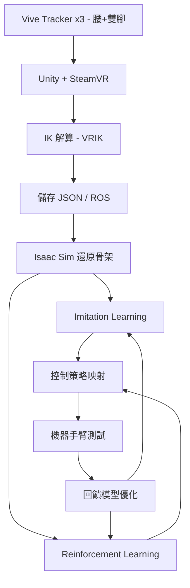

**Vision Base 技術整合簡報（初版 / 2025）**

---

### 專案目標

本計畫旨在透過 XR 技術與動作追蹤設備（Vive Tracker / Quest 3），模擬人類施工行為，導入高擬真模擬環境（Isaac Sim）並生成對應資料流，最終應用於機器學習與機械手臂的增強學習訓練。此架構將作為實驗室現有三組大型機械手臂之學習基礎與演示驗證場景。

---

### 技術架構

#### 一、感知輸入層（Human Motion Capture）

- **裝置配置**：

    - Vive Tracker ×3（配置於腰部與雙腳）

    - Quest 3（手部追蹤 / 頭部追蹤 / Scene Understanding）

- **資料處理**：

    - 使用 Unity + SteamVR 擷取 Tracker 姿態資訊

    - 整合 VRIK 系統進行 IK 解算，產出人體骨架動作流

    - 動作流以 JSON 格式儲存，或透過 ROS Bridge 傳送

#### 二、模擬與資料建構層（Physics & Simulation）

- **模擬環境**：

    - 使用 NVIDIA Omniverse Isaac Sim 建立施工互動場景

    - 導入 Unity 輸出的骨架資料與環境互動邏輯

- **用途**：

    - 重建人類動作流程，作為 AI 訓練的示範參考

    - 驗證人-機交替控制下的合理性與安全性

#### 三、學習演算法層（ML & RL）

- **學習方法**：

    - Imitation Learning：Behavior Cloning / DAgger

    - Reinforcement Learning：PPO / SAC with IsaacGymEnvs

- **訓練流程**：

    - 輸入為人類施工姿態與場景狀態資料

    - 模型輸出為控制策略，應用於手臂末端控制與策略規劃

#### 四、實體部署與驗證層

- 將學習策略映射至實驗室三台大型手臂

- 以模擬場景與真實動作比對為基準，驗證控制精度與穩定性

- 建立回饋機制：將實驗手臂的反應回傳模擬系統以持續調優模型

---

### 系統整合流程圖

---

### 預期效益

- 建立可重現且可擴充之人類施工動作數位模型

- 透過虛擬訓練降低實體訓練風險與成本

- 擴展實驗室在智能施工、自動化協作領域之技術能量

- 提供多模型與策略比較的訓練平台，支援長期研究與論文發表

---

### 技術關鍵字

`XR Human Demonstration` / `Imitation Learning` / `Isaac Sim` / `ROS2` / `Unity + SteamVR` / `Vive Tracker` / `Meta Quest 3` / `Digital Skeleton Pipeline` / `Multi-agent Simulation`

---

### 相關文件

- [[2025-cooperation-summary]]
- [[2025-xr-exhibition]]
