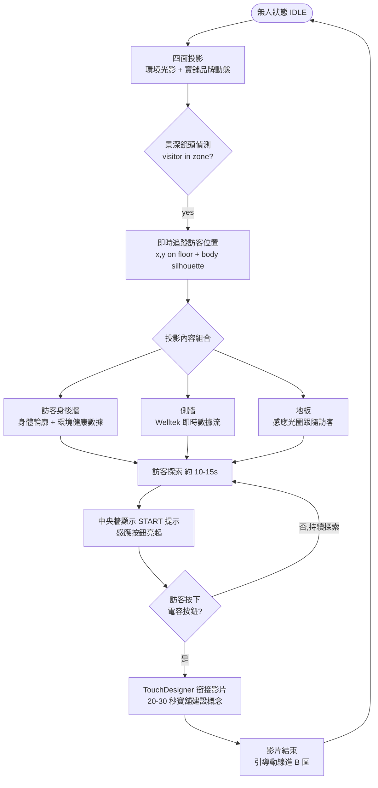
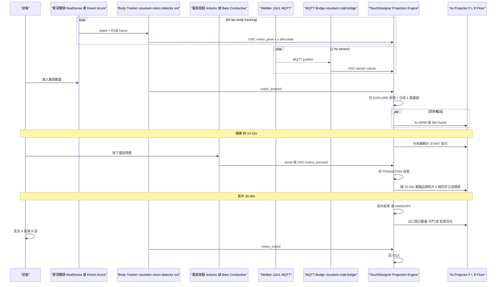
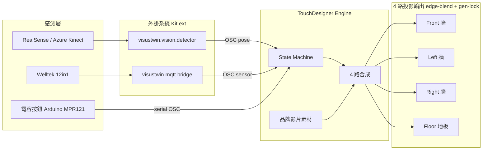

# 數據之門 · 策展轉場空間

> **2026-05-30 修正 #1**:第一版誤把 B 區的 TV 套在 A 區。
> A 區實際是 **4 顆投影機拼接的「三面環景 + 地板投影」沉浸空間** — 訪客「走進畫面裡」。
>
> **2026-05-30 修正 #2**:主體體驗後有**啟動按鈕**(中央牆前的電容感應)觸發 **TouchDesigner 銜接影片**(20–30 秒寶舖建設概念),影片結束才進入 B 區。Projection Engine 確定走 **TouchDesigner**。

## 區域定位

策展動線的**入場第一站**。訪客走進一個被投影包圍的空間(左/正/右牆 + 地板),景深鏡頭即時追蹤位置,身體輪廓 + Welltek 環境數據投在訪客身後牆面。**體驗 finale** 是訪客按中央牆前的電容感應按鈕,觸發 20–30 秒寶舖建設概念影片,影片結束後動線引導進 B 區,系統回到 IDLE 等下一位訪客。

## 投影面物理配置

```
                  正面牆投影 (PJ-Front)
                  + 中央電容感應按鈕 ●
              ╔═══════════════════════╗
              ║                       ║
左牆投影 ──→ ║      訪客站立區       ║ ←── 右牆投影
 (PJ-Left)    ║                       ║   (PJ-Right)
              ║   ▼ 地板投影 PJ-Floor ▼  ║
              ╚═══════════════════════╝
                       入口
```

- **3 顆牆面投影**:Front / Left / Right(三面環景)
- **1 顆地板投影**:吊在天花板,垂直向下
- **1 個電容感應按鈕**:中央牆前(實體位置與外形待定)
- 4 顆共需 **edge-blending** + **gen-lock**

## 頁面流程



## 系統互動



## 元件清單

| Component | 角色 | 既有 repo / 設備 | 新做 / 改造 |
|---|---|---|---|
| 投影機 × 4 | 三面環景 + 地板 | 短焦投影機(規格待場勘) | **採購** |
| Edge-blend / Warp | 接縫融合 + 幾何校正 | TouchDesigner 內建,或硬體 Datapath FX4 | TD 內建為主 |
| **TouchDesigner** | 4 路同步合成 + body tracking 接收 + 影片播放 + 出口指引 | TouchDesigner Commercial(license $2200/yr/seat) | **核心新做**,主要開發 |
| 電容感應按鈕 | START 觸發 → 進 TD 影片 | Arduino + 電容板 / Bare Conductive Touch Board / MPR121 + 訂製外觀 | **採購 + 整合**,serial → OSC 進 TD |
| Baopu 品牌影片 | 20-30 秒沉浸概念片(4 路同步) | 待製作 | **內容由策展/影片公司製作**,我們只負責 cue |
| 景深鏡頭 | 訪客位置 + 身體輪廓 | Azure Kinect / RealSense D435 / Orbbec Femto | **採購** |
| Body Tracker | depth → silhouette mask + 2D 座標 → OSC | `visustwin.vision.detector`(Kit Python ext) | **改造** — 加 depth SDK + OSC 輸出 TD |
| Welltek 12-in-1 | 環境感測來源 | 寶舖既有設備 | **採購 + 部署** |
| MQTT Broker | 感測資料匯流 | Mosquitto | 既有架構 |
| MQTT Bridge | MQTT → OSC 進 TD | `visustwin.mqtt.bridge`(Kit ext) | **改造** — 加 OSC 輸出 |
| Gen-lock / Sync | 4 路 frame 同步 | NVIDIA Quadro Sync / TD 軟體 vsync | **核心未決** |
| 主機 PC | 跑 TD + 接 4 路輸出 | Workstation 含 4× HDMI 或 Quadro RTX A5000+ | **採購** |

## 技術架構

**TouchDesigner 為主合成引擎,4 路投影輸出 + 多感測輸入。影像推論與感測接口為外掛系統(Kit ext),與 B/F 區的 web 棧完全獨立**

State machine:

```
IDLE  →  AMBIENT  →  EXPLORE  →  PROMPT  →  BTN_PRESS  →  TD_VIDEO  →  HANDOFF  →  IDLE
無人     偵測到訪客   追蹤 +      中央牆      訪客按下     20-30 秒     出口指引    回 IDLE
loop     切活躍       4 路合成    START 提示  電容按鈕     品牌影片     動畫
```

模組架構圖:



文字版模組:

```
TouchDesigner Core (主合成 + state machine + 4 路輸出)
├── 輸入  ←  visustwin.vision.detector   (Kit Python ext)  ← RealSense / Azure Kinect  (OSC visitor_pose)
├── 輸入  ←  visustwin.mqtt.bridge       (Kit ext)         ← Welltek 12in1 / MQTT      (OSC sensor_values)
├── 輸入  ←  Arduino MPR121               (serial → OSC)    ← 電容按鈕                  (OSC button_pressed)
├── 內容  ←  寶舖品牌影片素材 (20-30s,4 路同步檔 / super-wide 拼接)
└── 輸出  →  4× Projector  (Front / Left / Right / Floor,edge-blend + gen-lock,HDMI / SDI)
```

- **主 repo**:TouchDesigner project(.toe + cookbook,vault 待開 `02 產品/Baopu/A-touchdesigner/` 收 binary 與設定快照)
- **Kit ext**:[`visustwin.vision.detector`](待補 repo link)、[`visustwin.mqtt.bridge`](待補 repo link)
- **build target**:TouchDesigner Commercial(license $2200/yr/seat)+ Python 3.11 for Kit ext
- **state 同步**:state machine 完全跑在 TD 內部,無需 cue-server
- **跨區接點**:HANDOFF → B 區的時序是否要走中央 cue-server(B/F 用的那一台)協調,待定;目前 A 區獨立運作
- **與 B/F web 棧的關係**:**完全分離**。A 區走 TD/native,B/F 走 React Web。共用點只有「中央 cue-server 是否協調跨區交接」這條未決

## 未決點

### 啟動按鈕(新加!)
- [ ] 按鈕外觀:嵌在牆面 vs 獨立矮柱 vs 地面感應 vs 桌面物件
- [ ] 電容感應板選型:Arduino + MPR121 / Bare Conductive Touch Board / Capacitive 觸控玻璃模組
- [ ] 多人同時按時的策略(以第一個觸發為準)
- [ ] 觸發後是否可重按(影片中再按 → 忽略 / 重啟)
- [ ] 視覺回饋(按了之後牆面光效是否有 confirmation)

### Baopu 品牌影片
- [ ] 由誰製作(策展公司 / 廣告公司 / 寶舖自己 / 我們參與?)
- [ ] 解析度與尺寸(4 路同時播 = 大致 7680×2160 拼接 + 地板獨立 1920×1080)
- [ ] 是 4 個 .mov 同步檔還是 1 個 super-wide 檔
- [ ] 有沒有聲音 → 喇叭配置
- [ ] 多語系(中 / 英 / 日)
- [ ] 跑完是 fade-out 還是接 outro 動畫

### 投影硬體
- [ ] 4 顆投影機型號 + 亮度(暗場 3000 lm,亮場 5000+ lm)
- [ ] 短焦 vs 一般焦
- [ ] 地板投影機掛點與保護(被踩 / 散熱 / 鏡頭防塵)
- [ ] 結構梁 / 死角

### 訪客感測
- [ ] 景深鏡頭顆數(三面環景空間 1 顆視角夠不夠)
- [ ] Calibration:訪客 3D 位置反算到牆面投影 UV
- [ ] 多人處理(只追第一個 / 多人同框 / 拒絕第二人)
- [ ] visitor_entered → AMBIENT 切換延遲(< 500ms)

### TouchDesigner 開發(現在確定 stack 了)
- [ ] 團隊 TD 技能 — 我們自己會 TD 嗎,還是要外包 / 上手學
- [ ] TD network 結構:state machine(IDLE/EXPLORE/TRANSITION/HANDOFF)用 TD 哪種模式管理
- [ ] 跟 `visustwin-welltek-twin` 是否需要任何接點(or A 區完全自立?)
- [ ] 寶舖品牌影片素材 ingest 流程(版本控制 / 替換)

### 跟 B 區交接
- [ ] HANDOFF → B 區的時序(B 區 TV 何時亮起 / 等訪客真的走過去再亮)
- [ ] A 區回 IDLE 跟 B 區 entry 是否需要中央 cue server 協調

## Related

- 上游:訪客入口
- 下游:[[B-感應光寓]](樣品屋客廳,**TV 在這邊**)
- 同期:[[C-睡眠劇場]] / [[D-居家風險劇場]]
- 上層:[[01 專案/寶鋪 showcase/README|寶舖 showcase MOC]]
- 規格:[[01 專案/寶鋪 showcase/deliverables/OTA120_v6_draft|OTA120 v6 草稿]] §A 區 p.9-12
