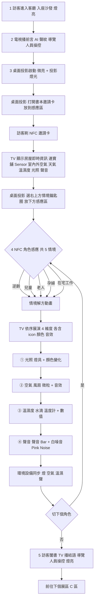
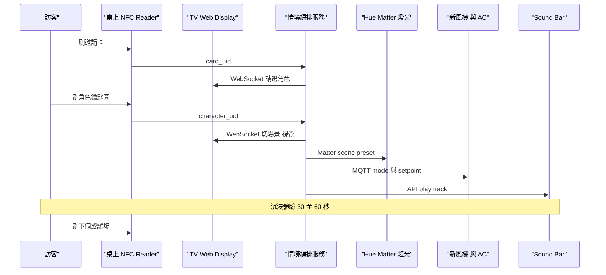
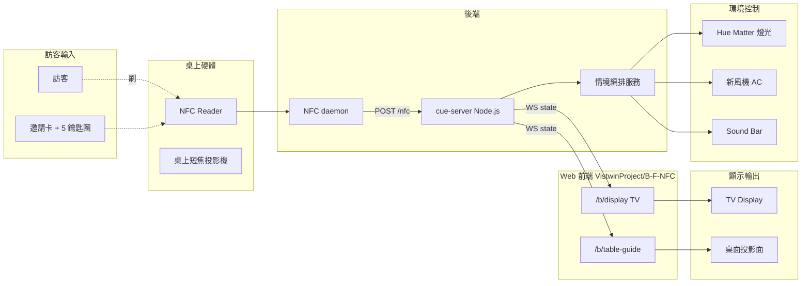

# 感應光寓 · 客廳

> [!info] 2026-06-02 更新:已比對客戶官方分鏡表 PDF(`b區分鏡.pdf`),下方流程與文案已對齊官方版。新增 §官方分鏡表、修訂頁面流程,並把三個與官方有出入的點移到 §未決點(角色數 4 vs 5、單一 vs 多感應區、解方動畫並行 vs 依序)。

## 區域定位

樣品屋客廳。導覽人員引導訪客入座沙發 → 電視以 AI 聲紋播放「前言」→ 桌面投影啟動,訪客拿**夾在書本內頁的 NFC 邀請卡**放到感應區 → 電視顯示**房屋即時資訊**(連動寶舖 Sensor / 數位孿生平台)→ 訪客選**情境角色鑰匙圈**放感應區 → 電視依序展演「光照→空氣→溫濕度→聲音」解方動畫,整個客廳的**光 / 空氣 / 溫濕度 / 聲音**四維度同步切換成對應的「智慧居家狀態」→ 導覽人員手動播放「結語」、訪客闔書離場。把 OTA120「全健築」的核心承諾從數字面板昇華成**全身體感**:選孕婦 → 室內就變成孕婦需要的環境;選兒童 → 整個房間調成兒童需要的條件。

**架構**:**TV(主顯示)** 跑 Web,顯示前言 / 房屋即時資訊 / 角色解方動畫 / 結語。**桌上投影 + NFC reader** — 桌上短焦投影只跑「NFC 放置提示 UI」(指引訪客把卡 / 鑰匙圈放哪),NFC reader 嵌桌做實際感應觸發。**環境設備**(燈 / 空氣 / 聲)同步切換。**前言與結語由導覽人員手動觸發**(走 override 管道)。沒有 iPad。

**道具**:邀請卡夾在**實體書本**內頁(開場「打開書 / 邀請卡」、結束「闔書」是體驗的起訖儀式);情境鑰匙圈置於桌面**右上方**,感應區在**下方**(依官方分鏡桌面投影佈局)。

**資料源**:房屋即時資訊(室內外空氣品質、天氣預報、溫濕度、光照、聲音)連動**寶舖 Sensor / 數位孿生平台**;5 情境的目標 setpoint 參考寶舖整理的數據表(見 OTA120 v6「使用數據內容」)。

## 頁面流程



## 官方分鏡表(客戶 PDF `b區分鏡.pdf`)

> 以下為客戶官方分鏡逐字整理,作為文案 / 燈光 / TV 動畫的權威來源。本區 web(TV + 桌面投影)應對齊此處文案。

| # | 步驟 | 畫面 / 動作 | 燈光 |
|---|---|---|---|
| 1 | 進場與前言開場 | 民眾入座沙發。**電視聲音開場**(AI 口吻):「歡迎來到『感應光寓』空間,我們將由你上個空間提供的自身資訊,為你提供專屬於你的居家體驗服務。準備好了嗎?體驗即將開始!3、2、1」 | 亮 |
| 2 | 電視前言 | 以 **AI 聲紋(Voiceprint)** 形式在電視播放前言(**導覽人員操控**) | — |
| 3 | 投影啟動 + 邀請卡 + 房屋即時資訊 | 桌面投影啟動。**書本內頁**夾 NFC 邀請卡 → 桌面投影聲音:「這是來自『未來居家』的邀請卡,打開邀請卡,將卡片移置感應區,同步房子的即時資訊」→ 卡片放感應區(目前設定邀請卡下方)→ **電視顯示房屋即時資訊**(小圖標+數字):室內外空氣品質、天氣預報、溫濕度、光照、聲音(連動寶舖 Sensor,詳如數位孿生平台資訊畫面) | 微亮 + 投影燈光 |
| 4 | 情境體驗(共 5 種,PDF 文字寫「4 種」⚠️) | 桌面投影:「看完了房子的即時健康數據,可選擇右上方的 4 種問題情境鑰匙圈,於下方感應範圍。你的痛點,寶舖有解方!」→ 拿鑰匙圈放感應區 → **電視依序展演解方動畫**:①光照(燈具+顏色變化)②空氣(風扇/微粒+音效)③溫濕度(水滴/溫度計+數值)④聲音(聲音 Bar + 白噪音 / Pink Noise)。導覽人員可視情況手動播放結語結束本段 | 微亮 + 投影燈光 |
| 5 | 結語離場 | **將書闔上** → 電視以聲音 Bar + AI 口吻播放結語(**導覽人員操控**):「房子的健康就是你的健康。房子的健康,我有解方!請往下個展區體驗。」 | 亮 |

**文宣文案(情境名稱,已轉疑問句語氣)**:成年人逆齡衰老 / 提高兒童免疫力 / 老年的安全守護 / 孕婦的安心休養 / 高效的在宅工作。
(對應 OTA120 v6 情境一~五:生理逆齡 / 原生健康 / 安全守護 / 極致純淨 / 數位遊牧。)

**解方動畫表現法**:用簡易圖像 + ICON + 文字,搭配動態 / 顏色 / 音效。①燈泡或燈具(顏色變化)②風扇或空氣微粒(結合聲音)③水滴或溫度計 ④聲音 Bar 或動態影像(白噪音 / Pink Noise)。

## 五情境 痛點 × 解方對照表

> [!note] 分工 + 呈現位置(2026-06-03 更新)
> **痛點分三層次**:
> - **L1 極短**(如「成年人逆齡衰老」)→ **電視右上卡片 eyebrow(位置①)**
> - **L2 一句話**(中等長度)→ **電視右上卡片主標(位置②)**
> - **L3 詳細長句** → **桌面投影(`B-Table`)端呈現**(電視不顯示)
>
> **解方** → **電視右下角**,且**逐維度輪播、字幕與畫面左側正在亮的維度圖卡同步**(右下說「①光照解方」時,左欄頂卡正好是①光照,房子燈光也切到光照)。
>
> 分工:電視 `b-tv` 寫 L1/L2 + 解方(已實作);桌面 `B-Table` 寫 L3 詳細長句 UI ✅ **已實作(2026-06-03)** — 左右分割版面:**左半** NFC 感應圓(刷卡漣漪對齊圓心),**右半** 角色身分 + L2 問句 + L3 痛點(手動斷行、靠左對齊)+「你的痛點,寶舖有解方。」。痛點資料在 `B-Table/src/personas.js` 的 `pain`(含 `\n` 手動斷行)。資料同源:電視端在 `b-tv/src/personas.js`(`painShort`/`painMedium`/`painLong`)與 `src/scenes.js`(每維度 `headline`/`detail`/setpoint)。setpoint 為展演代表值,正式數值以寶舖數據表為準。

### 總表 — 痛點三層次 + 解方核心

| # | 角色 | 情境 `id` | L1 極短(TV ①) | L2 一句話(TV ②) | L3 詳細長句(桌面) | 解方核心(TV 右下) |
|---|---|---|---|---|---|---|
| 1 | 成年人·抗衰老 | 生理逆齡 `anti-aging` | 成年人逆齡衰老 | 熬夜、壓力與老化,怎麼讓身體回到修復狀態? | 長期晚睡與壓力讓晝夜節律紊亂、氧化壓力升高,睡眠品質變差、修復不足,身體與外貌都加速老化。 | 校正晝夜節律 + 抗氧化純淨,啟動深層修復 |
| 2 | 兒童·提高免疫力 | 原生健康 `child` | 提高兒童免疫力 | 怎麼保護發育中的孩子,少生病、長得好? | 兒童發育中的肺部與視力脆弱,容易受空汙與藍光傷害;抵抗力弱、易過敏生病,睡眠也常被干擾而影響發育。 | 護眼全光譜 + 醫療級潔淨,守護發育 |
| 3 | 老人·在宅終老 | 安全守護 `elder` | 老年安全守護 | 怎麼讓長輩在家安全、安心地終老? | 長者視覺退化、夜間容易跌倒;慢性病讓血壓波動與失溫風險升高,緊急狀況也常無人即時察覺。 | 高照度補償 + 防跌防失溫 + 安全監測 |
| 4 | 孕婦·在家休養 | 極致純淨 `pregnancy` | 孕婦安心休養 | 怎麼給孕媽咪一個零毒害、能好好休養的家? | 孕期對甲醛等毒害極度敏感、擔心影響胎兒;身心壓力大、睡眠不安,體感也容易不適。 | 零毒害微環境 + 柔和無頻閃 + 極靜療癒 |
| 5 | 高效·在家辦公 | 數位遊牧 `nomad` | 高效在家工作 | 在家怎麼維持專注,不被環境拖累效率? | 在家工作容易分心、午後倦怠;CO₂ 累積讓頭腦昏沉、決策力下降,環境噪音也干擾深度工作。 | 專注照明 + 清醒新風 + Pink Noise 遮蔽 |

### 細表(痛點細項 × 四維度解方)

四維度順序固定:①光照 ②空氣 ③溫濕度 ④聲音。

#### 1 · 成年人 抗衰老(生理逆齡)
- **痛點**:長期晚睡、晝夜節律紊亂、睡眠品質差;工作壓力與氧化壓力高;室內光單調無法支持生理時鐘;修復不足、顯老。

| 維度 | 解方 | 代表 setpoint |
|---|---|---|
| ①光照 | 晝夜節律照明:模擬日光週期,白天冷白喚醒、入夜暖光助眠,校正生理時鐘 | 2200–6500K 動態 · 800 lux |
| ②空氣 | 抗氧化純淨空氣:負離子淨化 + 高效過濾,降低氧化壓力、延緩老化 | PM2.5 5 µg/m³ · CO₂ 580 ppm |
| ③溫濕度 | 深層修復溫區:微涼恆溫促進夜間修復與生長激素分泌 | 24.0°C · 50% RH |
| ④聲音 | 深層修復聲景:低頻 Delta 波背景音,引導深睡與細胞再生 | 35 dBA · Delta Wave |

#### 2 · 兒童 提高免疫力(原生健康)
- **痛點**:發育中肺部與視力脆弱,易受空汙與藍光傷害;抵抗力弱、易過敏易生病;睡眠易受干擾影響發育。

| 維度 | 解方 | 代表 setpoint |
|---|---|---|
| ①光照 | 護眼全光譜:高顯色全光譜 + 無藍光危害,保護發育中視力 | 500 lux · 4000K |
| ②空氣 | 醫療級潔淨:HEPA 三重過濾,守護肺部與免疫系統 | PM2.5 3 µg/m³ · TVOC 0.05 mg/m³ |
| ③溫濕度 | 舒適防敏:溫和恆濕抑制塵蟎與過敏原 | 25.0°C · 55% RH |
| ④聲音 | 低噪安睡:柔和白噪音遮蔽干擾,穩定睡眠週期 | 32 dBA · White Noise |

#### 3 · 老人 在宅終老(安全守護)
- **痛點**:視覺退化、夜間易跌倒;慢性病、血壓波動、失溫風險;緊急狀況無人即時察覺。

| 維度 | 解方 | 代表 setpoint |
|---|---|---|
| ①光照 | 高照度視覺補償:提高照度補償視覺退化,夜間動作感應地燈預防跌倒 | 750 lux · 3000K |
| ②空氣 | 安全守護監測:持續監測空氣與燃氣,異常即時警示 | PM2.5 8 µg/m³ · CO₂ 650 ppm |
| ③溫濕度 | 防失溫恆溫:偏暖恆溫避免血壓波動與失溫 | 26.0°C · 50% RH |
| ④聲音 | 清晰安靜聲學:提升語音清晰度,緊急警報音可被即時辨識 | 40 dBA · Clear Speech |

#### 4 · 孕婦 在家休養(極致純淨)
- **痛點**:對甲醛/TVOC 等毒害極度敏感、擔心影響胎兒;孕期身心壓力大、睡眠不安;體感易不適。

| 維度 | 解方 | 代表 setpoint |
|---|---|---|
| ①光照 | 柔和無頻閃照明:無頻閃柔光降低眼壓與焦慮,營造安心休養 | 300 lux · 2700K |
| ②空氣 | 零毒害微環境:醫療級過濾 + 零甲醛,為母嬰純淨呼吸 | PM2.5 3 µg/m³ · 甲醛 0.03 mg/m³ |
| ③溫濕度 | 舒適安養:恆溫恆濕緩解孕期不適 | 25.0°C · 55% RH |
| ④聲音 | 極靜療癒聲景:近乎無聲輔以海浪胎教音,緩解身心壓力 | 30 dBA · Ocean Calm |

#### 5 · 高效 在家辦公(數位遊牧)
- **痛點**:在家難專注、易分心、午後倦怠;CO₂ 累積導致昏沉、決策力下降;環境噪音干擾深度工作。

| 維度 | 解方 | 代表 setpoint |
|---|---|---|
| ①光照 | 專注抗疲勞照明:高照度中性白提升警覺與專注,抑制午後倦怠 | 750 lux · 4500K |
| ②空氣 | 清醒新風換氣:持續新風維持低 CO₂,保持頭腦清醒 | PM2.5 6 µg/m³ · CO₂ 700 ppm |
| ③溫濕度 | 提神工作溫區:微涼乾爽抑制睏意,維持長時間專注 | 23.0°C · 45% RH |
| ④聲音 | 專注遮蔽聲場:Pink Noise 遮蔽環境干擾,鞏固深度工作 | 45 dBA · Pink Noise |

## 電視情境牆 · 配色系統(b-tv)

> 對應 `b-tv/src/bento/bento.css` 色票與 `src/bento/SceneBento.jsx` 配色邏輯。設計原則:**不用純白、不用純黑**(深底只保留 3D 房子那格襯托模型);**同一畫面同時出現的卡片顏色不重複**;**不是固定位置固定色**,每換一個維度整組顏色輪轉一次,過場以 CSS 平滑漸變。

- **色票(10 色,皆飽和、深色字)**:`yellow #ffd60a` · `orange #ff5a2c` · `coral #f6566e` · `pink #ff77c8` · `purple #a274f0` · `indigo #6d8bf5` · `sky #8fd0f5` · `teal #2fcfc0` · `green #25c06b` · `lime #bfe34a`。(另有 `ink #0c0f13` 僅給 3D 房子格;`cream` 已停用。)
- **同畫面 6 張卡**:左欄 3(維度數據)+ 中欄 1(獨立輪播)+ 右欄痛點 1 + 解方 1。
- **配色規則**(同畫面 6 格不重複):
  - **痛點卡(右上)= 白(cream)固定** — 最簡潔,只有換角色內容才變。
  - **全健築指數卡(3D 房子正下方)= 綁角色的固定色** — 當這間房子的整體分數常駐(不再輪播雜項數據)。
  - 其餘 4 格(左欄 3 + 解方)隨維度從色票輪轉(排除上述固定色),`offset = 維度index × 3` → 每換維度輪轉一次、仍不撞色。
- **卡內資料元素**(數字/長條/圖表/波形/甜甜圈)用 `currentColor`,自動依卡片底色取深色 → 任何顏色上都清楚。
- 驗證:四個維度 steady state 皆「6 張卡 6 種不重複顏色、無白、無黑(房子除外)」。

## 電視 3D 房子 · 渲染與效能(b-tv `src/bento/HouseCanvas.jsx`)

> 2026-06-06 大幅更新。已套用客戶 Rhino 匯出的**真實樣品屋**(`showroom.3dm` → `showroom.gltf` → `public/house.glb`)。

- **模型**:894 個 mesh / 約 **45.5 萬三角面** / 31 顆純色材質、**無任何貼圖、無 UV**。扁平樓層平面(正規化後約 3 寬 × 2 深 × 0.6 高)。
- **材質(全程式分層,零手動)**:依「原始材質名 + 原色明度」自動分流成暖色豪宅材質——米白建築(依面向分牆/地/天花,地板較光滑做拋光反射)、駝皮、米灰布、香檳金、暖鋼、半透玻璃、自發光燈具、暖胡桃木深飾、暖青銅飾條;比對不到→預設米白。邏輯在 `pickMaterial()`。
- **光照**:ACES tone mapping + 室內 HDRI(Poly Haven `brown_photostudio_02`,**CC0**,放 `public/hdr/studio.hdr`,強度壓低)+ 純暖黑背景;**全填充光改暖色**避免暗面/反射偏冷藍;暖向主光 + 陰影。
- **程式補天花板 + 藏燈帶**:模型沒天花板 → 依樓面輪廓程式補一片暖白天花 + 周圍發光燈槽(吃 bloom)+ 暖點光間接光;天花投影 → 室內由室內燈主導,夜晚明暗對比。
- **效能(關鍵,曾經很卡)**:
  - 依材質**合併幾何 894 → 約 12 個 mesh**(draw call 砍 ~98%)。
  - **SSAO 預設關**(每幀重畫整場 2~3 遍太吃 FPS;`USE_SSAO` 開關)、**DPR 鎖 1**、Bloom 保留。
  - 有存檔機位時**跳過 36 條 ×45 萬面 raycast**(≈1600 萬次測試)。
  - **關閉 React StrictMode**(避免雙重掛載 → 兩個 WebGL context 解析 41MB 模型)。
  - **換角色時房子不 remount**(App 用固定 `'scene'` key + 房子格不帶 persona key)→ 不重新初始化、燈光平滑過渡;進場動畫由各卡片以 `persona.id` 為 key 重播。
- **可調常數**(`HouseCanvas.jsx` 頂部):`ENV_INTENSITY / EXPOSURE / AMBIENT_SCALE / BG_COLOR / USE_SSAO / BLOOM_* / CEILING / COVE_* / DOWNSPOT_INT`。
- **機位**:室內漫遊定點機位 + 阻尼過場 + 慣性飄移;用「機位編輯工具」(`camera-tool.html`,WASD 飛行 + FOV + 截圖,存 localStorage `houseViewpoints`)手設。
- **節奏**:每維度停留 **5 秒**(`BEAT_MS 5000 × BEATS_PER_DIM 1`),每維度 1 次鏡位移動;走完 4 維約 20 秒進 loop。

> [!note] 寫實質感(2026-06-06 討論結論,暫緩)
> 即時渲染(現在這套)的質感有上限——沒有光反彈(GI),牆面偏平、像乾淨 CG。要到 Shapespark 那種畫廊級,關鍵是**離線烤 GI lightmap**(路徑追蹤把光烤成貼圖,執行時只貼圖 → 又美又順)。可用本機 **Blender 4.5 + RTX 3070** 無頭烤(我方驅動;材質指定沿用現有分類器、**不需手動上材質**),或直接用 Shapespark 平台。**靜態模型最適合烤、烤完即時超順**;唯一取捨:烤光是靜態的,情境換燈要嘛烤多版、要嘛烤中性基底 + 即時光輕微點綴。**先擱置,材質/動畫優先。**

## 系統互動



## 元件清單

| Component | 角色 | 既有 repo / 設備 | 新做 / 改造 |
|---|---|---|---|
| TV Display | 主顯示 — 提示 + 角色選擇 UI + 場景視覺,**Web kiosk** | 大尺寸 TV + browser kiosk | **改造**(web kiosk 模式 + 場勘 TV 尺寸) |
| 桌上投影 | 輔助 — 投影「NFC 放置提示」UI,指引卡 / 鑰匙圈位置(Web) | 短焦投影機(吊頂或桌邊) | **採購** + **改造**(web) |
| 桌上 NFC Reader | 純觸發硬體 — 感應邀請卡 + 5 個角色鑰匙圈 | USB ACR122U / RPi PN532,嵌桌 | **採購 + 整合** |
| 桌上投影 Web | 桌面 NFC 放置提示 + 角色痛點 UI | ✅ **已建** [`VistwinProject/B-Table`](https://github.com/VistwinProject/B-Table)(Vite + React 18,全 CSS 動畫;連 `ws://8788` 自推導狀態;內建鍵盤模擬器;web 5273) | 左右分割版面(左 NFC 感應圓 / 右 角色痛點 L3);實體 UID 已燒錄。投影機選型 + 與實體 reader 對位待場勘 |
| TV Web | TV kiosk 主顯示:前言 / 房屋即時資訊 / 角色解方動畫 / 結語 | ✅ **已建**(本機 `b-tv`,Vite + React 18 + framer-motion 11 + **three.js**;web 5274、WS 連 8788) | 全 NFC 驅動完成;情境展演為 bento 動態資料牆 + 一格 three.js **客戶真實樣品屋**(Rhino `showroom` 匯出,室內漫遊運鏡、燈光隨情境變、程式補天花板+藏燈帶)。詳見 §電視 3D 房子。模型已套上(`public/house.glb`,gitignore)|
| 情境編排服務 | 5 個情境的 light/air/temp/sound 同步指令,接 NFC 輸入 | — | **新做** — Node.js(同 `B-F-NFC` repo 的 `bridge/`) |
| Hue / Matter | 燈光控制 | Philips Hue Bridge | 既有架構 |
| AC + 新風機 | 空氣 / 溫度 | 寶舖既有 + MQTT 控制器 | 寶舖提供 |
| Sound Bar | 背景音 / 聲學情境 | 待選(Sonos / Bose Smart Soundbar) | **採購** |
| 邀請卡 + 5 NFC 鑰匙圈 | 訪客 token | NTAG215 + 物理外觀 | **採購 + 客製** |

## Web 架構

**2 個 web 前端(TV 主 + 桌上輔助)+ 共用 cue-server**。桌上 NFC reader 是硬體,不是 web。

技術架構圖:



```
/b/display     (TV,Web kiosk 主顯示)— 已依官方分鏡更新
├── /idle              待機畫面(歡迎訊息 / 環境氛圍動畫)
├── /intro             前言(AI 聲紋視覺 + 開場語音,導覽人員觸發)        ★新增
├── /prompt/card       請刷邀請卡(可與桌面投影同步)
├── /house-info        房屋即時資訊(連寶舖 Sensor:室內外空氣/天氣/溫濕度/光照/聲音)★新增
├── /prompt/character  請選角色(5 個選項)
├── /scene/逆齡        逆齡情境 — 依序解方動畫 光照→空氣→溫濕度→聲音
├── /scene/兒童
├── /scene/老人
├── /scene/孕婦
├── /scene/遊牧
├── /loop              情境體驗中(輕量動畫 + 可切下個角色)
└── /outro             結語(聲音 Bar + AI 口吻,導覽人員觸發)            ★新增

/b/table-guide (桌上投影,輔助提示 UI)— ✅ 已實作於 repo VistwinProject/B-Table
├── /idle              桌面氛圍動畫(目前以 place-card 為待機吸引狀態)
├── /place/card        把邀請卡放這(animated NFC 圖示在感應點上方)
├── /place/character   把角色鑰匙圈放這
└── /confirmed         感應成功提示(2-3 秒 fadeout,目前實作為覆蓋式漣漪)
```

- **repo**:[`VistwinProject/B-F-NFC`](https://github.com/VistwinProject/B-F-NFC)(B 兩 web + F 三 web 都同 monorepo,以 route 分頁)
- **build target**:Vite + React 18 + framer-motion 11
- **state 同步**:WebSocket → cue-server,TV `/b/display` 跟桌上 `/b/table-guide` 同步狀態(TV 提示「請刷卡」時桌上同步亮起 `/place/card`)
- **桌上 NFC**:本機 daemon 讀 reader,POST `/nfc` 給 cue-server,觸發後 cue-server 廣播給兩個 web 前端
- **cue-server**:共用後端,規格定義在 [[F-AI大腦控制塔#cue-server-共用後端]];B 區關注的 API:
  - `POST /nfc` 接 card_uid 與 character_uid
  - `WS /ws/state` 廣播當前 role 給 TV display
  - `POST /override` 展務員手動切(走另一台筆電,不在訪客視野)

> [!important] 現況協議(2026-06-02)— 給電視 session 接手用
> 上面的 cue-server `/ws/state` 是**目標架構,尚未實作**。**目前已建好的桌面投影 `VistwinProject/B-Table` 直接沿用 F 區 `vibenfc` 的 WS 協議**:連 **`ws://localhost:8788`**(見下方埠口表),server 廣播 `reader-connected` / `tag-present` / `tag-remove`(`tag-present.data` 內含 `id`、`kind`(`card`/`character`)、`label`),前端**自行從原始 NFC 事件推導畫面狀態**。
> - **電視 session 兩條路**:(A) 跟桌面投影一樣連 `ws://8788` 自己推導狀態(最快、與現況一致);(B) 等 cue-server 做出 `/ws/state` 權威狀態源,兩個前端都接它(較乾淨,但 cue-server 尚未開工)。建議先走 (A),日後 cue-server 上線再切。
> - 協議細節見 `vibenfc/SYNC-SPEC.md`;角色 `id` 字串需與 `B-Table` 的 `src/personas.js`(`anti-aging`/`child`/`elder`/`pregnancy`/`nomad`)及 `server/uid-map.json` 對齊。
> - `POST /override`(前言/結語手動觸發)目前**尚未有後端**,需隨 cue-server 或在 8788 server 上擴充一個 `reset`/`override` 訊息。

> [!example] 實體 NFC UID 對應(2026-06-03 已燒錄,`B-Table/server/uid-map.json`)
> 已用真實 NTAG215 卡燒錄並驗證。`tag-present.data.id` 即下表 id;角色照情境順序。
>
> | UID | id | 標籤 | kind |
> |---|---|---|---|
> | `B7F6401E` | `invite` | 邀請卡 | card |
> | `FE53411E` | `anti-aging` | 生理逆齡 | character |
> | `B00C411E` | `child` | 原生健康 | character |
> | `EEA1E43C` | `elder` | 安全守護 | character |
> | `FB9AE53C` | `pregnancy` | 極致純淨 | character |
> | `4F54E53C` | `nomad` | 數位遊牧 | character |

> [!success] 電視端回報(2026-06-02)— 給桌面 session
> **電視 TV display 已實作完成**,本機 repo:`C:\Users\frncs\Desktop\寶鋪\b-tv`(Vite + React 18 + framer-motion 11 + **three.js**;web **5274**、WS 連 **8788**;走上面的 path A,直接從原始 NFC 事件推導狀態)。
> - **全流程已改為純 NFC 驅動,電視端不需任何鍵盤 / 人工操作**:刷邀請卡 → 自動播前言 → 房屋即時資訊 → 刷角色鑰匙圈 → 該情境 bento 解方牆(含一格 three.js 自動旋轉房子,燈光隨情境變化)→ 換鑰匙圈即換情境 → **90 秒無刷卡** 自動播結語、回待機。
> - 待機 / 前言 / 選角色 / 結語維持深色 teal 風;「房屋即時資訊 + 5 情境解方」改成 bento 動態資料牆。
>
> **⚠️ 為什麼「桌面操作了、電視沒反應」(關鍵整合點,需桌面 / server 處理):**
> `B-Table` 的鍵盤模擬器(`c` / `1-5` / `x` / `r`)是 `src/App.jsx` 裡**直接呼叫本機 `ingest()`,並沒有 `ws.send` 出去**。所以模擬器的刷卡只改桌面自己的畫面,**不會經過 8788 server,也不會廣播給電視**(電視是另一個 client)。電視只吃 **server 廣播**的事件。
> - 已驗證:**接真實讀卡機**時,8788 server 會把 `tag-present` / `tag-remove` 廣播給**所有** client,電視即時反應(實測一張真實 anti-aging 鑰匙圈 → 電視直接進該情境)。所以**正式現場接上 reader 就會通**,兩端自動同步。
>
> **✅ 已實作(2026-06-02)— 鍵盤模擬也跨端同步**:
>   1. **`b-livingroom/server/server.py` 已加 dev 注入**:`ws_handler` 現在會收前端訊息,放行 `tag-present`/`tag-remove`/`reset`/`intro`/`outro` 並原樣 `broadcast()` 給所有 client。
>   2. **桌面 `B-Table`(`b-livingroom/src/App.jsx`)鍵盤模擬器已改**:`c`/`1-5`/`x`/`r` 改成 `ws.send` 進 server(連線時),未連線才 fallback 本機 `ingest`。
>   3. **電視 `b-tv` 鍵盤(`i`/`o`/`r`/`c`/`1-5`/`x`)同樣走 `ws.send` 廣播**;`n`(下一步)為電視本機流程不廣播。
>   - ⚠️ **要生效必須重啟 8788 server**(載入新 `server.py`):舊的跑著的 process 不會收前端訊息。重啟後,在桌面**或**電視按鍵,兩個畫面都會同步。
>   - 注意:改用廣播後,單獨開電視(沒連到 server)時鍵盤會走 fallback 本機;但若連到的是**舊**(未注入)server,按鍵會被 server 忽略且不 fallback → 務必重啟 server。
> - **電視吃的事件合約(請桌面 / server 對齊)**:`tag-present` 的 `data.kind` 必為 `'card'` 或 `'character'`;`data.id` 角色字串為 `anti-aging`/`child`/`elder`/`pregnancy`/`nomad`,卡為 `invite`(與 `B-Table` `src/personas.js`、`server/uid-map.json` 一致)。`tag-remove` 無 payload。
>
> **NFC 事件 → 電視反應對照:**
> | 事件 | 電視 |
> |---|---|
> | `tag-present` kind=card(待機時) | 自動播前言 → 房屋即時資訊 |
> | `tag-present` kind=character | 進入該情境 bento 解方牆 + 房子變燈光 |
> | `tag-remove` / 換另一張 character | 清感應點 / 直接換情境 |
> | 90 秒無事件 | 自動播結語 → 回待機 |
> | server 送 `reset` / `intro` / `outro` | 重置 / 強制播前言 / 強制播結語(override 已接好) |
>
> **結語觸發**:目前無「闔書」感應器,用 90 秒無活動逾時收尾。若要精準,桌面偵測闔書(或展務員按鈕)時往 8788 送一筆 `outro` 或 `reset` 即可,**電視端已接好**。

> [!warning] 埠口配置(展覽同網域,務必避開 F 區)
> 現場所有 zone 共用一台主機 / 網域,埠口**寫死 + `strictPort`**,被占就報錯、絕不漂移去撞別區。
>
> | Zone | App | Web | WS |
> |---|---|---|---|
> | F(既有) | 桌面 / 牆面 / 平板 | 5173 / 5174 / 5175 | 8787 |
> | **B** | 桌面投影 `B-Table` | **5273** | 連 **8788** |
> | **B** | **TV display(本 session 要做)** | **5274** | 連 **8788** |
> | B | NFC WS server | — | **8788** |
>
> ⚠️ **電視 session 請用 web `5274`、WS 連 `8788`**。B 區的 NFC server 必須跑 8788(F 占 8787);若 B 重用 vibenfc `server.py`,記得把 `WS_PORT` 從 8787 改成 8788。

## 未決點

### 與官方分鏡表的落差(2026-06-02 比對 `b區分鏡.pdf` 後新增,需向客戶確認)

- [x] ⚠️ **角色數 4 vs 5**:官方分鏡內文兩處寫「**4 種**問題情境鑰匙圈」,但同頁文宣文案列了 **5 項**(成年人逆齡 / 兒童免疫 / 老年安全 / 孕婦休養 / 在宅工作),且 OTA120 v6 簡報「使用數據內容」是 5 個情境。**研判「4 種」為舊版殘留,實際 5 個**,但需客戶拍板。本區 web 現以 5 個實作。
- [x] ⚠️ **單一 vs 多感應區**:官方分鏡寫「拿不同問題鑰匙圈放入**不同感應區域**」,可能暗示每個角色各有感應點(多 reader);但 v6 簡報與目前桌面投影實作是**單一感應區**(卡 + 鑰匙圈依序刷同一點)。需確認桌面感應點數量 → 直接影響投影 UI 佈局與 reader 數量。
- [ ] ⚠️ **解方動畫:並行 vs 依序**:官方分鏡明寫電視解方動畫「**依序**:光照→空氣→溫濕度→聲音」;舊流程圖畫的是 4 維並行。TV 動畫已改為**依序**,但環境設備(燈/空氣/聲)實際切換可並行,需確認動畫節奏與設備動作的對應。
- [ ] **書本道具**:邀請卡夾在實體書內頁、結束「闔書」是儀式動作 — 需確認書本由誰提供、闔書是否要被系統偵測(或純由導覽人員口頭引導 / 手動 override)。
- [ ] **房屋即時資訊畫面**:卡片感應後電視顯示的「房屋即時資訊」(室內外空氣 / 天氣預報 / 溫濕度 / 光照 / 聲音)資料源 = 寶舖 Sensor / 數位孿生平台 — 需拿到資料介面 / 畫面規格(是嵌寶舖既有畫面還是我們重做)。
- [ ] **前言 / 結語觸發**:皆「導覽人員操控」— TV web 需做展務員手動播放控制(走 `POST /override`),前言用 AI 聲紋、結語用聲音 Bar + AI 口吻。

### 原有未決

- [ ] **TV 尺寸與擺位**:客廳場景 TV 多大、掛牆 / 桌上 / 立架,影響 web kiosk 排版
- [ ] **桌上短焦投影機選型**:距離 / 流明 / 投影面尺寸(只投 NFC 提示 UI,亮度需求比 A 區低很多)
- [ ] **桌上投影 + NFC reader 對位**:UI 上的「放這」圖示要精準對應感應點實體位置
- [ ] **NFC reader 嵌桌方式**:嵌底(透投影面)/ 桌面感應點 / 桌邊感應槽
- [ ] iOS 系統的 NFC 限制不影響(我們不用 iPad,reader 走 USB → 本機 daemon)
- [ ] 情境編排服務跟 `B-F-NFC` 同 repo 還是另開
- [ ] 5 個情境的 setpoint 是否走寶舖 APP 既有控制管道,還是我們直接打設備
- [ ] 多訪客同時刷不同角色 → 後到的覆蓋還是排隊
- [ ] 情境切換的 fade 時間(瞬間切 vs 5 秒漸變)
- [ ] 鑰匙圈丟失補發 / 防偷
- [ ] OTA120 文件提到的 5 個 persona 跟簡報 v6 對應(逆齡 / 兒童 / 老人 / 孕婦 / 數位遊牧)— 鑰匙圈視覺要對應這 5 個
- [x] ✅ **桌面 ↔ 電視跨端同步(2026-06-02 已實作)**:8788 `server.py` 加了 dev 注入、桌面 `B-Table` 與電視 `b-tv` 鍵盤模擬都改走 `ws.send` 廣播。**重啟 8788 server 後生效**,在任一端按鍵兩個畫面同步。詳見上方 §「電視端回報」callout。
- [x] ✅ **房子 3D 模型(2026-06-06 已套上)**:客戶 Rhino `showroom` 匯出 → `b-tv/public/house.glb`(大檔,gitignore;`studio.hdr` 已納入 git)。材質/光照/天花板/效能/運鏡見 §電視 3D 房子。模型缺天花板已程式補上;載入失敗才退回 placeholder。
- [ ] **3D 寫實升級(暫緩)**:即時渲染質感有上限;若要畫廊級,走 Blender 烤 GI lightmap(本機 RTX 3070 可無頭烤)或 Shapespark。見 §電視 3D 房子 末的 note。
- [x] ✅ **情境停留/換卡節奏**:每維度 5 秒(可改 `BEAT_MS`);換角色房子不 remount、卡片錯開進場動畫。

## Related

- 上游:[[A-數據之門]]
- 下游:[[C-睡眠劇場]]
- 同期:[[D-居家風險劇場]]
- 同棧(NFC + 桌上投影 共用):[[F-AI大腦控制塔]] — B 用 TV 主顯示 + 桌上 NFC 投影提示,F 用桌上 NFC 互動投影(物件詳情)+ 牆面投影 + iPad;NFC reader 與桌上短焦投影機同款可共用
- 上層:[[01 專案/寶鋪 showcase/README|寶舖 showcase MOC]]
- 規格:[[01 專案/寶鋪 showcase/deliverables/OTA120_v6_draft|OTA120 v6 草稿]]
