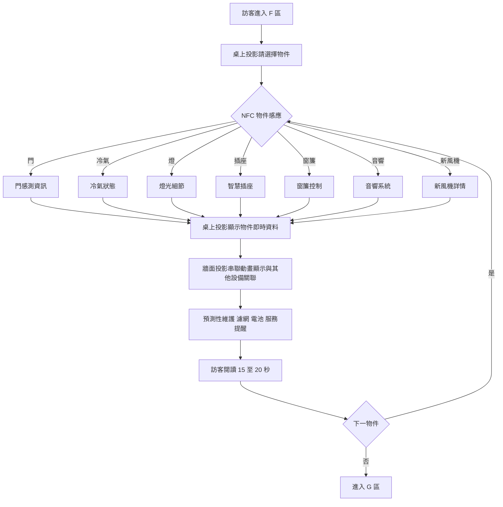
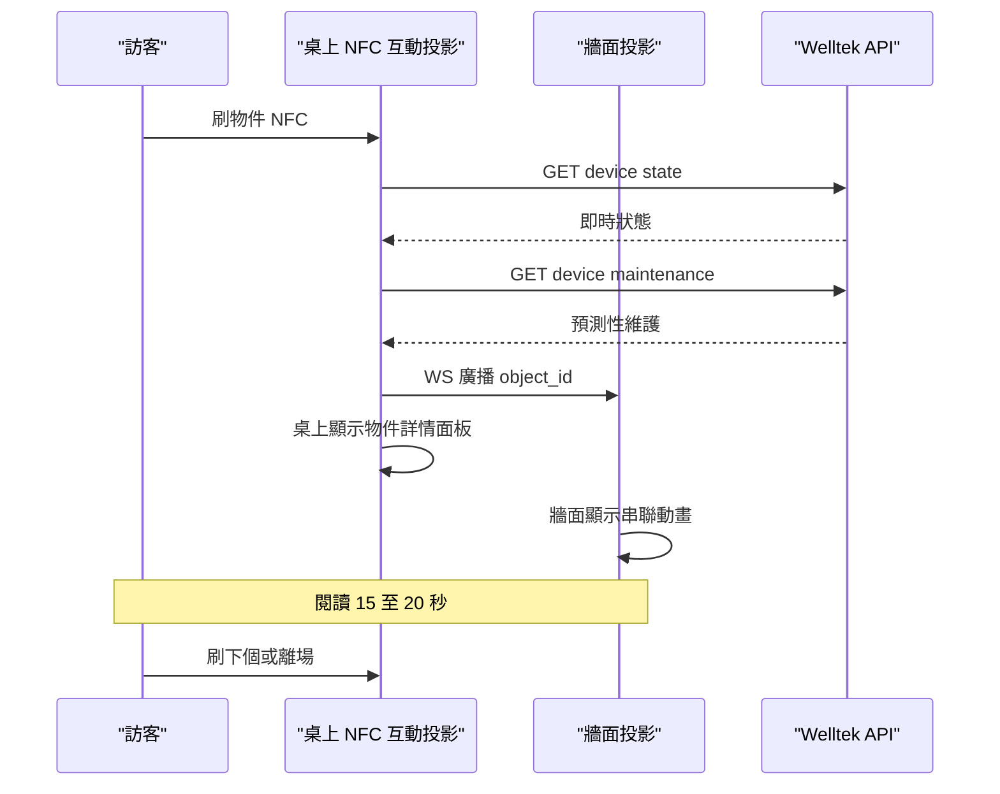

# AI 大腦控制塔 · 後台暗場 F 區

## 區域定位

策展後台第二站(E 區建築中控台之後)。訪客在控制檯**桌上 NFC 互動投影**刷代表家電的實體物件(門、冷氣、燈、插座、窗簾、音響、新風機),**桌上投影**顯示該物件即時狀態 + 預測性維護,**牆面投影**同步串聯動畫(設備間關聯)。重點傳達「AI 大腦」不是抽象概念,而是**真的在後台主動管理家中設備、提前預警**。

**3 個展示 surface**:桌上 **NFC 互動投影**(短焦投影 + 嵌桌 NFC reader + Web)+ 牆面投影(串聯動畫,Web)+ **iPad**(Web 跑 AI 知識圖譜)。

> iPad 跑同 `B-F-NFC` repo 內的 `/f/ipad/graph` route,內容**只有 AI 知識圖譜**。是否跟桌上刷物件 WS 同步(刷物件 → 知識圖譜高亮對應節點)待定。

## 頁面流程



## 系統互動



## 元件清單

| Component     | 角色                                        | 既有 repo / 設備                                                                                                         | 新做 / 改造                           |
| ------------- | ----------------------------------------- | -------------------------------------------------------------------------------------------------------------------- | --------------------------------- |
| 桌上 NFC 互動投影   | 訪客 surface — 刷物件 + 投影顯示物件即時資料 + 預測性維護     | [`VistwinProject/B-F-NFC`](https://github.com/VistwinProject/B-F-NFC)+ 短焦投影機 + 嵌桌 NFC reader                         | **採購**(投影機 + reader)+ **改造**(web) |
| 牆面投影          | 串聯動畫(設備間關聯)                               | 短焦投影 + Web canvas / framer-motion 動畫                                                                                 | **採購**(投影機)+ **改造**(動畫)           |
| 7 個物件 NFC tag | 門/冷氣/燈/插座/窗簾/音響/新風機 token                 | NTAG215 + 物件外觀(mock-up)                                                                                              | **新做** — 物件外觀設計 + NFC 配對          |
| Welltek API   | 設備狀態 + 維護資料                               | 寶舖 / Welltek 既有                                                                                                      | 寶舖提供,需確認 API spec                 |
| 預測性維護資料源      | 濾網週期 / 電池電量 / 服務提醒                        | 簡報明列新風機週期;其他待補                                                                                                       | **資料模型新做** — 7 個物件各定義維護欄位         |
| iPad          | 第 3 個展示 surface — **Web 跑 AI 知識圖譜**(僅此功能) | iPad + Safari/Chrome kiosk,跑 [`VistwinProject/B-F-NFC`](https://github.com/VistwinProject/B-F-NFC) 的 `/f/ipad/graph` | **改造**(web)— 加知識圖譜 module         |

## Web 架構

**3 個 web 前端(桌上 + 牆面 + iPad)+ 共用 cue-server**

技術架構圖:

```mermaid
flowchart LR
    subgraph Input["訪客輸入"]
        V["訪客"]
        Objs["9 物件 NFC tag"]
    end
    subgraph HW["展場硬體"]
        Reader["嵌桌 NFC Reader"]
        TablePJ["桌上短焦投影機"]
        WallPJ["牆面投影機"]
        IPad["iPad"]
    end
    subgraph Web["Web 前端 VistwinProject/B-F-NFC"]
        TableRoute["/f/table 物件詳情"]
        WallRoute["/f/wall 串聯動畫"]
        IpadRoute["/f/ipad/graph 知識圖譜"]
    end
    subgraph Backend["後端"]
        Daemon["NFC daemon"]
        Cue["cue-server Node.js"]
        Welltek["Welltek API"]
    end
    subgraph Display["顯示輸出"]
        TableProj["桌面投影面"]
        WallProj["牆面投影面"]
        IPadScreen["iPad 螢幕"]
    end
    V -.->|"刷"| Reader
    Objs -.-> Reader
    Reader --> Daemon
    Daemon -->|"POST /nfc"| Cue
    Cue -->|"WS object_id"| TableRoute
    Cue -->|"WS object_id"| WallRoute
    Cue -.->|"WS 同步 待定"| IpadRoute
    TableRoute -->|"GET state"| Welltek
    TableRoute -->|"GET maintenance"| Welltek
    TableRoute --> TableProj
    WallRoute --> WallProj
    IpadRoute --> IPadScreen
    TablePJ -.- TableProj
    WallPJ -.- WallProj
    IPad -.- IPadScreen
```



```
/f/table  (桌上 NFC 互動投影,投影顯示物件詳情面板)
├── /idle                 待機 + 請刷物件
├── /object/door
├── /object/ac
├── /object/light
├── /object/plug
├── /object/curtain
├── /object/sound
├── /object/fan
├── /object/:id/maintenance   預測性維護 overlay
└── /transition           物件切換動畫

/f/wall   (牆面投影,串聯動畫)
├── /idle                 7 物件網絡 overview
├── /active/:id           高亮當前物件 + 關聯設備
└── /relation/:id         串聯動畫(門→冷氣→新風機 連鎖)

/f/ipad   (iPad — Web 跑 AI 知識圖譜,僅此功能)
├── /graph                 7 物件 + 設備關聯知識圖譜全景
├── /graph/:node           節點詳情(該物件的關聯設備、依賴鏈、AI 推理路徑)
└── /graph/path/:from/:to  兩節點間連鎖關係動畫
```

- **repo**:[`VistwinProject/B-F-NFC`](https://github.com/VistwinProject/B-F-NFC)(與 B 區共用同 repo,monorepo 內以 route 分頁)
- **build target**:Vite + React 18 + framer-motion 11
- **state 同步**:WS 廣播當前 object_id,/f/table 跳 panel、/f/wall 同步高亮;/f/ipad 是否同步(訪客刷物件 → 知識圖譜高亮對應節點)待定

## cue-server(共用後端)

B、F 兩區共用同一台 Node.js cue-server(整個展也可選擇延用,跨 7 區):

```
POST /nfc           {reader_id, uid, kind: "card"|"character"|"object"}
                    入口統一,後端根據 reader_id 路由給對應區的 handler
WS   /ws/state      廣播 { zone, scene/object, timestamp }
GET  /scenes        列出 B 區 5 角色情境定義
GET  /objects       列出 F 區 7 物件 + Welltek 對應
POST /override      {zone, payload} 展務員手動覆寫(走另一台筆電)
```

- **部署選項**:(a) 一台 cue-server 管全展(路由清楚、單點故障)(b) B/F 各一台(隔離但部署複雜)— 待拍
- **NFC 接入**:USB ACR122U 或 RPi PN532 走 serial → 本機 daemon → POST /nfc
- **WS 客戶端**:每個前端頁開啟時 subscribe 自己 zone,收到 state 即更新 route

## 控制與操作職責(誰觸發什麼)

- **開始體驗 = 訪客自助**:訪客在**桌上固定平板**(`/f/ipad`, :5175)自己點 → 發 `session-start`,桌面+牆面+桌上平板同步進互動頁。**不是**展務員操作,F 區本身不需要展務「開始/結束」鈕。
- **刷卡 = 自動觸發**:實體卡放感應區 → NFC 自然觸發,無按鈕。
- **展務員的跨區控制**(含「手動觸發家電 demo」)走另一支隨行控制平板 → 見 [[0-隨行控制平板]]。F 區後端需提供的 hook(`manual-trigger` / `manual-clear`)也記在那份文件,這裡不重複。

## 未決點

- [ ] **iPad 知識圖譜規格**:
  - 圖譜範圍 — 只 F 區 7 物件 / 加進 B 區 5 角色 / 全展 ontology
  - 訪客可互動(拖、縮、點)還是純展示自動播
  - 跟桌上 NFC 是否 WS 同步(刷物件 → 知識圖譜高亮對應節點)
  - 操作方式 — 訪客手持 / 桌邊固定立架 / 展務員講解
- [ ] **桌上短焦投影機選型**:距離 / 流明 / 投影面尺寸
- [ ] **NFC reader 嵌桌方式**:嵌底 / 透投影面 / 桌邊感應
- [ ] **桌上 + 牆面對齊**:訪客視角是否同時看到桌上面板 + 牆面動畫,還是視線需切換
- [ ] Welltek API spec 寶舖能不能提供(簡報 p.38 6 個物件都標「需寶鋪提供」)
- [ ] 預測性維護資料是 mock 還是真實 — 展期短可以 mock,長期則接寶舖系統
- [ ] 物件 mock-up 由策展公司做還是我們做(影響交付週期)
- [ ] 多人同時刷不同物件 → 排隊 / 分螢幕 / 拒絕
- [ ] NFC tag 物件外形要不要做成跟實品按比例的縮小模型(影響成本)

## 三畫面同步規格(桌面 / 牆面 / 平板 WS 協議)

> 來源:桌面端 repo `nfc-web-control/SYNC-SPEC.md`(2026-05-30,2026-05-31 同步更新)。給**牆面**跟**平板** session 看,說明桌面端已實作的內容、事件協議、需三端對齊的項目。
>
> ⚠️ 注意:本節描述的 stack(`nfc-web-control` + Python ws server :8787)與本文上半 §Web 架構 / §cue-server 描述的 `VistwinProject/B-F-NFC` + Node.js cue-server **不一致**。**目前實作以本節為準**(`nfc-web-control` + Python ws),上半的 cue-server + 統一 monorepo 是早期規劃,尚未動工,合併時再決定方向。

### 1. 架構總覽

**確認:桌面 / 牆面 / 平板 三個 web 跑在同一台電腦上。**

```
                                  ┌──── 桌面 web (nfc-web-control/web)
                                  │     http://localhost:5173/
                                  │     → 中央光束扇形 + 家電儀表板
                                  │
[9 台 ACR122U] → Python ws server ─┼──── 牆面 web
            (ws://localhost:8787)  │     http://localhost:5174/
                                  │     → 房屋平面圖串聯動畫
                                  │
                                  └──── 平板 web
                                        http://localhost:5175/
                                        → 觸控/知識圖譜面板
```

- **唯一資料源**:`nfc-web-control/server/server.py`(Python + pyscard + websockets,固定 listen `localhost:8787`)
- **單一事件流**:server 同步廣播給所有 connected client
- 三端**不互通**,全部透過 server 同步狀態
- 三端**同機通訊**,走 loopback,延遲 ~100µs(感知為瞬時)

### 1.1 URL 對照(已拍板,三端依此設定)

| 畫面 | 前端 URL | Vite dev port | WS 連線目標 |
|---|---|---|---|
| **桌面** | `http://localhost:5173/` | `5173` | `ws://localhost:8787` |
| **牆面** | `http://localhost:5174/` | `5174` | `ws://localhost:8787` |
| **平板** | `http://localhost:5175/` | `5175` | `ws://localhost:8787` |

**牆面 session 須在自己的 `vite.config.js` 寫死 port 5174**:
```js
export default defineConfig({
  plugins: [react()],
  server: { port: 5174, strictPort: true, host: true },
})
```

**平板 session 同樣寫死 port 5175**:
```js
export default defineConfig({
  plugins: [react()],
  server: { port: 5175, strictPort: true, host: true },
})
```

`strictPort: true` 確保 port 被佔用時直接報錯,不會悄悄 fallback 到 5176 之類,避免投影機指向錯的 URL。

三者**完全獨立的 React app**(獨立 repo / 獨立 build),共通點只有「都連同一個 ws://localhost:8787」。

> **若之後改用 cue-server 統一架構**(本文 §Web 架構 那個方案),三個畫面會變成同一個 monorepo 下的不同 route(`/f/table`、`/f/wall`、`/f/ipad`),走同一個 dev server 不同 path。**目前不是這樣**,以本表為準。

### 2. WebSocket 連線

- **URL**:`ws://localhost:8787`(三端統一,因為三端同機)
- **server bind**:目前 server.py L168 是 `await websockets.serve(ws_handler, 'localhost', WS_PORT)`,**只接受 loopback 連線**,正好符合三端同機的需求,**不用改**。
- **無 handshake**:client 連上後 server 會主動推送目前 9 個 slot 的當前狀態(重發 `reader-connected` + `tag-present`),所以重連後不用 query。
- **重連**:client 端自己處理。桌面用 3 秒間隔 reconnect,建議牆面/平板同樣。

### 3. 事件協議(server → client 廣播)

四種訊息,全部 JSON。

#### `reader-connected`
讀卡機插上電腦時。
```json
{ "type": "reader-connected", "slot_index": 0, "reader": "ACS ACR122U PICC Interface 00 00" }
```

#### `reader-disconnected`
讀卡機拔掉時。
```json
{ "type": "reader-disconnected", "slot_index": 0 }
```

#### `tag-present`
卡片刷上去(含未註冊的)。`known=false` 時 `data=null`。
```json
{
  "type": "tag-present",
  "slot_index": 0,
  "uid": "04DA53A76F2681",
  "known": true,
  "data": {
    "id": "door",
    "label": "大門",
    "description": "...",
    "osc": "/nfc/door",
    "model": "/models/xxx.ply"
  }
}
```

#### `tag-remove`
卡片拿走。
```json
{ "type": "tag-remove", "slot_index": 0 }
```

#### `session-start` / `session-end`(**雙向**,客戶端 ↔ server)
唯一可以由 client 端送出的訊息類型。**用途:平板按「開始」→ 同步切換桌面 + 牆面從歡迎頁進入互動頁**。

流程:
```
[平板] ws.send({"type": "session-start"})
  ↓
[server] 收到 → session_state="live" → 廣播給所有 client
  ↓
[桌面/牆面/平板] 收到 → setMode("live") → 換頁同步
```

`session-end` 反向(回歡迎頁)。

```json
{ "type": "session-start" }
{ "type": "session-end" }
```

Server 會記住目前 session 狀態,新 client 連上時若 session 已是 `live`,server 主動補送 `session-start`(避免 mid-session reload 掉回歡迎頁)。

⚠️ Server 只接受 `session-start` / `session-end` 兩種 client → server 訊息,其他 type 一律忽略。NFC 事件永遠由 server 發出。

### 4. 狀態模型(建議三端共用)

每個 slot(index 0–8)三種狀態,視覺強度遞增:

| 狀態 | 條件 | 視覺含義 | 桌面行為 |
|---|---|---|---|
| **Idle** | `connected=false` | 沒讀卡機,靜默 | 微弱底噪光束 |
| **Connected** | `connected=true, activeCard=null` | 讀卡機等卡片 | 中等亮度光束 |
| **Active** | `activeCard!=null` | 有資料 | 滿格 + 動畫 sweep + 端點爆閃 |

> **建議三端用同一套 idle/connected/active 三級對應**,視覺寫法各做各,但語義對齊。

### 5. 家電 ID 對照(**需三端 freeze**)

桌面端的家電 data 用 `data.id` 當 key 查表。**三端必須用同一組 ID 字串**才能對應。

#### 目前已定義(`server/uid-map.json`)
| UID | id | label |
|---|---|---|
| `04DA53A76F2681` | `door` | 大門 |
| `4F54E53C` | `air` | 智能家電01(測試卡) |

#### 規格目標(依 OTA120 v6,7 個家電)

✅ **已 freeze 的 7 個 appliance id 字串**(三端不准改):

| id | 中文 | 備註 |
|---|---|---|
| `door` | 門 | |
| `ac` | 冷氣 | |
| `light` | 燈 | |
| `socket` | 插座 | |
| `curtain` | 窗簾 | |
| `sound` | 音響 | |
| `hrv` | 新風機(全熱交換機)| |

三端的 `appliance id → 視覺位置/家電卡片` mapping 各自實作,但 **id 字串必須完全一致**,否則對不上。新增家電時改 server 的 `uid-map.json` 加 UID → id,三端同步加自己的 mapping。

#### 桌面端目前 mock 的家電資料結構
詳見 `nfc-web-control/web/src/components/InfoPanel.jsx` 的 `APPLIANCES` 物件:
```js
{
  name:   '全熱交換機',
  metric: '用電量',
  unit:   'kWh',
  today:  { label, value, deltaPct, deltaColor },
  trend:  { '日': [...], '週': [...], '月': [...], '年': [...] },
  trendYMax: { '日': 50, ... },
  month:  { label, value, target },
  maint:  [{ id, icon, name, last, next, status, label }]
}
```
之後接 Welltek API,三端可共用這個 schema(或各自需要自己的精簡版)。

### 6. Slot ↔ 家電綁定(已拍板:**走方案 A**)

✅ **決議**:**slot_index 不帶語意**。三端**一律用 `data.id` 路由**(即卡片貼什麼家電就是什麼家電,插哪個 reader 都行)。slot_index 只用來「同一張卡片從 X reader 移到 Y reader 時要熄滅 X 亮起 Y」這種純物理層的事。

實作:
- **server.py**:**不用改**。維持目前的「插入順序自動分配 slot」邏輯。
- **桌面 / 牆面 / 平板**:都用 `tag-present.data.id` 當 key,查自己的 `id → 視覺位置` mapping。例如牆面有:
  ```js
  const POS_ON_FLOORPLAN = {
    door:    { x: 0.05, y: 0.50 },
    ac:      { x: 0.78, y: 0.22 },
    light:   { x: 0.50, y: 0.30 },
    socket:  { x: 0.35, y: 0.80 },
    curtain: { x: 0.92, y: 0.55 },
    sound:   { x: 0.20, y: 0.60 },
    hrv:     { x: 0.65, y: 0.10 },
  }
  ```

好處:
- 卡片貼好家電 = 永久綁定,卡片可隨意換 reader
- server 不用維護 reader serial → slot mapping
- 三端各自定義「家電 → 自己畫面上要做什麼」,完全解耦

### 7. 設計 token(已 freeze,三端必須一致)

✅ **規定主色與狀態色**,複製貼上到自己的 CSS variables:

```css
--accent:   #009393;   /* 主 teal */
--accent-2: #4dbaba;
--green:    #4dbaba;   /* 正常 */
--amber:    #f59e0b;   /* 警告 / 即將到期 */
--red:      #f43f5e;   /* 錯誤 / 離線 */

/* 光束亮色(動畫漸變範圍) */
beam-cyan:   rgba(0,   220, 220, 0.16-0.95)   /* idle → active 強度 */
highlight:   rgba(220, 255, 255, 0.95)         /* sweep 慧星亮白 */
```

✅ **規定字體**:
- 主中文:`Chiron Hei HK` (CDN: `https://cdn.jsdelivr.net/npm/chiron-hei-hk@latest/css/ChironHeiHK.css`)
- 數字 / HUD:`JetBrains Mono`
- 顯示:`Space Grotesk`

不准用其他字體 / 主色。維持三端視覺一致。

### 8. 動畫節奏(**建議對齊讓三端感覺同步**)

桌面端 active 狀態:

- **Sweep 慧星**:sweep 沿光束從 **slot → 核心**(資料回流),週期 1.0 秒,3 顆同時錯開 1/3 週期
- **端點爆閃**:sweep 週期起點 = 節點「emission moment」(fill-opacity 1 + 大 drop-shadow,0~20% 週期內爆閃完)
- **Halo 呼吸**:1.4 秒週期
- **Idle 跟 connected**:**完全沒有 sweep / 流動 / 脈衝** —「沒有資料在傳就不該假裝有」

牆面 / 平板若要做光束類動畫,建議:
- 三端同時收到 `tag-present` → 用收到時間當動畫起點(不要求精確同步 ms,~100ms 內感知一致即可)
- Active 期間維持動畫;收到 `tag-remove` → 動畫停止 + 漸退

### 9. 多卡同時刷(已拍板)

✅ **三端都 allow 多卡同時 active**,但「詳細面板 / 焦點視圖」只聚焦**最後一個 `tag-present` 收到的家電**(最新刷的奪焦)。

各端行為規定:
- **桌面**:9 條光束各自獨立、依 active 狀態亮起;InfoPanel 顯示最後刷的家電儀表板。
- **牆面**:房屋平面圖上**所有 active 的家電同時高亮**(疊加 OK);串聯動畫(設備關聯)只跑最後刷的那一個。
- **平板**:同樣,所有 active 家電顯示在 list/grid 上,最後刷的展開詳細卡。

維護「最後刷的」用一個簡單 state 就好:每收到 `tag-present` 就更新 `focusedId = msg.data.id`;收到 `tag-remove` 且該 slot 的 id 等於 focusedId 時,fallback 到剩下 active 家電的最新者,或回 idle。

### 10. 已拍板事項 ✅ vs 真未決 ⏳

#### 已拍板(三端依此實作,不准問)
- [x] **WS server 位置**:桌面 PC localhost:8787
- [x] **7 個 appliance ID 字串**(§5):`door / ac / light / socket / curtain / sound / hrv`
- [x] **Slot ↔ 家電 mapping**(§6):方案 A — slot_index 不帶語意,三端用 `data.id` 路由
- [x] **前端 port**(§1.1):桌面 5173 / 牆面 **5174** / 平板 **5175**(`strictPort: true`)
- [x] **設計 token**(§7):accent `#009393`、字體 `Chiron Hei HK` + `JetBrains Mono` + `Space Grotesk`
- [x] **多卡 UX**(§9):全部同時 active,焦點視圖跟「最後刷的」

#### 真未決 ⏳(需後續決策)
- [ ] **Welltek API spec**(寶舖回覆中):拿到後決定 fetch 邏輯放 Python server side 還是各 client side
- [ ] **平板尺寸與比例**(影響佈局):需展務確認用哪台 iPad / Android pad
- [ ] **預測性維護資料來源**:展期短期用 mock / 長期接寶舖系統
- [ ] **物件 mock-up 製作方**:策展公司 / 我們做
- [ ] **三端是否最終合併 monorepo + cue-server**(§Web 架構 方案):看開發中期阻力決定

### 11. 給牆面 / 平板的 WS client 範例

JavaScript(平板可直接用):

```js
const WS_URL = 'ws://localhost:8787'  // 三端同機,固定 localhost
const RECONNECT_MS = 3000

const slotStates = Array.from({ length: 9 }, () => ({
  connected: false, readerName: '', activeCard: null
}))

let ws = null
let reconnectTimer = null

function connect() {
  ws = new WebSocket(WS_URL)
  ws.onopen = () => clearTimeout(reconnectTimer)
  ws.onmessage = ({ data }) => {
    const msg = JSON.parse(data)
    const i = msg.slot_index
    switch (msg.type) {
      case 'reader-connected':
        slotStates[i] = { ...slotStates[i], connected: true, readerName: msg.reader }
        break
      case 'reader-disconnected':
        slotStates[i] = { connected: false, readerName: '', activeCard: null }
        break
      case 'tag-present':
        slotStates[i].activeCard = { uid: msg.uid, known: msg.known, data: msg.data }
        break
      case 'tag-remove':
        slotStates[i].activeCard = null
        break
    }
    render()  // your own render function
  }
  ws.onclose = () => {
    slotStates.fill({ connected: false, readerName: '', activeCard: null })
    reconnectTimer = setTimeout(connect, RECONNECT_MS)
  }
  ws.onerror = () => ws.close()
}
connect()
```

Python(如果牆面 / 平板那邊另外有 Python 後端需要接,純 web 不需要):

```python
import asyncio, json, websockets

async def listen():
    while True:
        try:
            async with websockets.connect('ws://localhost:8787') as ws:
                async for msg in ws:
                    handle(json.loads(msg))
        except Exception:
            await asyncio.sleep(3)
```

### 12. 桌面端的視覺定位(**僅限 nfc-web-control repo,不影響牆面/平板**)

牆面跟平板**完全不需要**抄這部分,但讓你知道桌面長什麼樣:

- 9 個 NFC 槽位排成上半圓扇形(180°)
- 奇數位(NFC 01/03/05/07/09)在外圈、偶數位內縮 70%
- 核心方塊在扇形圓心
- 左側欄位:家電專用儀表板(今日用電 / 趨勢 / 累積 / 維養)
- 沒有任何按鈕互動(純投影顯示)

## Related

- 上游:[[01 專案/寶鋪 showcase/zones/E-建築中控台]](待寫)
- 下游:[[G-逃出危機模擬室]](策展 finale,逃生 QTE + 染色燈 + 電動玻璃門)
- 同棧(桌上 NFC 互動投影 共用):[[B-感應光寓]] — 兩區都是 NFC 互動投影架構,硬體可共用;B 是「情境觸發」、F 是「資訊探索」,UX 目的不同
- 上層:[[01 專案/寶鋪 showcase/README|寶舖 showcase MOC]]
- 規格:[[01 專案/寶鋪 showcase/deliverables/OTA120_v6_draft|OTA120 v6 草稿]]
