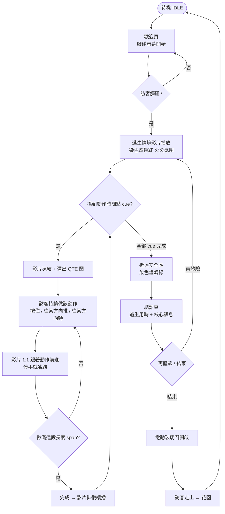
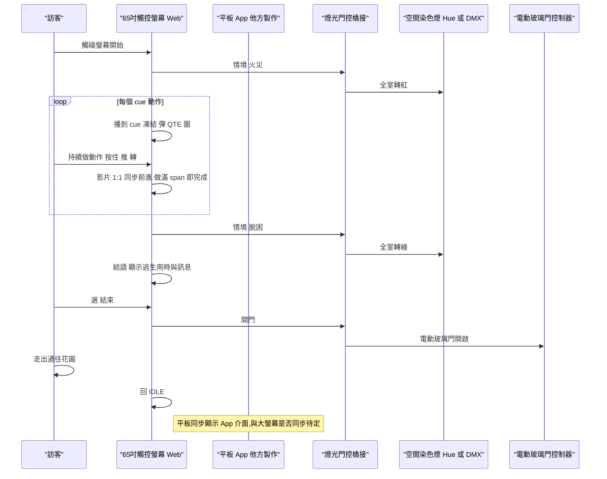

# 逃出危機模擬室 · 策展 finale G 區

> 全名「AI × 數位學生 智慧安全疏散：動態逃生顧問」。策展動線最後一站,體驗結束由**電動玻璃門**離開通往**花園**。

## 區域定位

策展動線的**最後一站**(F 區 AI 大腦控制塔之後)。訪客站在 **65 吋觸控螢幕**前,跟著一支逃生情境影片**做手勢(QTE)親身演練火場逃生**;整個空間的**染色燈**隨劇情變色(火災→紅、脫困→綠)營造臨場感;旁邊**平板**跑實際 App 介面(動態逃生顧問)。體驗結束顯示**逃生用時**與核心訊息(「把不可預測的災難,化為可計算的安心與信任」),**電動玻璃門開啟**引導訪客走出通往花園,系統回 IDLE 等下一位。

**架構**:**65 吋觸控螢幕**跑 Web(主體驗,逃生影片 + QTE)+ **平板**跑 App 介面(他方製作)+ **空間染色燈**(隨情境變色)+ **電動玻璃門**(結束開門)。沒有 NFC、沒有投影。

> ⚠️ **G 與 B/F/A 不同棧**:G 是**獨立 web repo + 原生 TypeScript**(不在 B/F 的 `B-F-NFC` React monorepo,也不是 A 的 TouchDesigner)。純前端、離線可跑、單機 kiosk。

## 頁面流程



## 系統互動



## 互動機制 — 影片時間軸 + engagement(G 區核心)

不是「看影片」,是**跟著影片裡的動作親手做**:

1. 逃生影片以 **1:1 正常速**播放(不快不慢)。
2. 播到某個動作的時間點(cue)→ **影片凍結**、彈出對應的 QTE 圈。
3. 訪客**持續做那個動作**(按住 / 往某方向推 / 往某方向轉)→ 影片**就以 1:1 跟著往前播**、進度環同步填;**一停手就凍結**。
4. 做滿這個動作的長度(`span`)→ 完成 → 影片恢復續播,前往下個 cue。

> 影片永遠 1:1(用「做動作=真播、停手=暫停」達成,**不是 seek 跳影格**,所以順不卡頓)。`span` = 該動作在影片裡的長度,由對位工具抓出。

**七種操作**:順時針旋轉、逆時針旋轉、上滑、下滑、左滑、右滑、按住。視覺為 Detroit: Become Human 風格的科技極簡 icon(細線、刻度環、四角框、青色 accent),歡迎頁 / 品牌列 / 結語頁統一風格 + Rajdhani 科技字體。

## 元件清單

| Component | 角色 | 既有 repo / 設備 | 新做 / 改造 |
|---|---|---|---|
| 65 吋觸控螢幕 | 主體驗 — 逃生影片 + QTE(**Web kiosk**) | [`VistwinProject/G-Escape-from-Crisis`](https://github.com/VistwinProject/G-Escape-from-Crisis)(Vite + 原生 TS,純前端離線) | **新做**(MVP 已完成)+ **場勘**(65 吋觸控對位) |
| 平板 App 介面 | 第二 surface — 動態逃生顧問 App | 平板 + Web / native kiosk | **他方製作**;與大螢幕是否同步待定 |
| 空間染色燈 | 隨情境變色(火→紅、安全→綠)營造氛圍 | Hue / DMX / Matter 燈具 | **採購 + 整合**;需 web→燈光橋接 |
| 電動玻璃門 | 結束開門,通往花園 | 電動玻璃門 + 控制器(乾接點 / relay / Modbus) | **採購 + 整合**;需 web→門控訊號 |
| 逃生情境影片 | 主視覺素材(逃生 3D 模擬 / 實拍) | 待製作(目前用接近調性的測試片) | **內容由影片 / 3D 團隊製作**,我們負責對位 + QTE |
| 背景音樂 | 獨立音軌(逃命緊張感) | 待製作(目前 WebAudio 合成暫時音樂) | **配樂他方**;repo 內 `bgm:` 一行接入 |
| 燈光門控橋接 | web 事件 → 染色燈 / 電動門 硬體 | — | **新做** — 小型 bridge(WebSocket / MQTT / serial / relay) |
| kiosk 主機 PC | 跑 web + 1080p 影片 | 一般 Windows PC + Chrome/Edge kiosk | **採購 / 沿用** |

## Web 架構

**單機單螢幕 web,無 cue-server**。對外(染色燈 / 電動門 / 平板)的同步另接 bridge(見 §展場整合接點)。

- **repo**:[`VistwinProject/G-Escape-from-Crisis`](https://github.com/VistwinProject/G-Escape-from-Crisis)(**獨立 repo**,非 `B-F-NFC` monorepo)
- **build target**:**Vite + 原生 TypeScript**(無框架、純前端、離線可跑)
- **三層解耦**:Scene 狀態機 / QTE 引擎 / Overlay
- **畫面**:固定設計 1920×1080 + `transform: scale()` 等比置中;Pointer Events 統一觸控/滑鼠;kiosk 觸控鎖定(`touch-action:none`、禁右鍵/縮放/長按)

```
src/
  script.ts        ★ 劇本：影片路徑 + cues(time/span/qte)+ 結語。改體驗主要動這裡
  core/SceneManager.ts ★ 狀態機 + 影片同步(engagement)控制
  qte/             七種 QTE(swipe / rotate / hold …)
  overlay/qteIcon.ts   Detroit 風 icon 產生器
  align/AlignMode.ts ★ 對位工具(?align)
  core/bgm.ts      獨立背景音樂層
public/assets/video/*.mp4   影片(⚠ 不入 git，需手動放)
```

兩個入口:

```
/              體驗模式（待機 → 影片+QTE → 結語 → 開門）
/?align        對位模式（抓 cue 時間/長度/位置，一鍵匯出 cues 設定）
```

**cue 設定範例**(`script.ts`):

```ts
{
  time: 25.0,   // 動作在影片開始的秒數
  span: 2.0,    // 動作長度（玩家就要做這麼久、影片這段 1:1 播這麼久）
  subtitle: '順時針轉開門把',
  qte: { type: 'rotate', params: { hint: { x: 960, y: 540 }, direction: 'cw', degrees: 300, label: '轉開門把' } },
}
```

**對位流程**(正式影片進來時):換 `video:` 路徑 → 開 `?align` 抓每個動作的 `time/span/位置` → 匯出貼回 `script.ts` → 補 `subtitle/label`。詳見 repo `README.md`。影片若非 30fps,改 `AlignMode.ts` 的 `FPS` 常數。

## 展場整合接點（染色燈 / 電動門）

純 web 已能跑完整體驗;**G 區比單機 web 多的是兩個硬體整合點**,目前 repo 內是「螢幕內」版本,接實體硬體需橋接:

- **染色燈**:repo 內已有「燈光色調層」(火災→紅、脫困→綠,目前是螢幕內 CSS 全屏染色)。對接**實體空間染色燈**時,web 在情境切換時對外發事件(建議 WebSocket / MQTT / HTTP)→ 小型 bridge → Hue / DMX 控制全室燈具。可考慮沿用展場 cue-server(B/F 那台)或 G 自帶 bridge。
- **電動玻璃門**:結語頁按「結束」時,web 對外發「開門」訊號 → bridge → 門控(relay / 乾接點 / Modbus)→ 電動玻璃門開啟 → 訪客走出通往花園。需含安全(感應到人才開、防夾、超時自動關)。
- **平板 App**:他方製作的動態逃生顧問 App。是否跟大螢幕同步(大螢幕進度 → 平板高亮 / 同步畫面)待定;若要同步同樣走 bridge / WS。

## 未決點

- [ ] **染色燈控制接口**:web 怎麼通知實體燈光(WebSocket / MQTT / HTTP → bridge → Hue / DMX);沿用展場 cue-server 還是 G 自帶 bridge
- [ ] **染色燈範圍 / 型號 / 變色時機**:涵蓋全室還是局部;火→紅 漸變 vs 瞬切;脫困→綠 的時點
- [ ] **電動玻璃門控制接口**:relay / 乾接點 / Modbus;觸發時機(結語「結束」按下 vs 自動);**安全**(感應人才開、防夾、超時回關)
- [ ] **平板 App**:由誰做、跟大螢幕是否同步(進度高亮 / 畫面同步)、擺位
- [ ] **正式逃生影片**(3D 模擬 / 實拍):解析度 / fps;進來後用 `?align` 重抓 cue
- [ ] **正式配樂** + 完整音效系統(火聲等 SFX 層、QTE 時音樂 ducking、混音)
- [ ] **每關 `subtitle` / `label` 文案** + 每個動作的「意義」定義(結語動作回顧)
- [ ] **法規文案**:官方文案用「動態逃生顧問 / AI 運算最佳安全路徑」,與「法規不能建議路徑、只能標火警位置」有張力,正式對外用字待拍
- [ ] **65 吋觸控螢幕**:型號 / 觸控技術(紅外 vs 電容)/ 擺位(立式 vs 桌式)/ 對位
- [ ] **多訪客**:排隊 / 中途離場 / 重置
- [ ] **kiosk 主機規格**(跑 1080p 影片 + web)
- [ ] **出口動線**:電動門 → 花園 的實體銜接、無障礙

## Related

- 上游:[[F-AI大腦控制塔]]
- 下游:出口 / 花園(策展終點)
- 同棧:**無** — G 是獨立 web repo(原生 TS),與 B/F 的 `B-F-NFC` React monorepo、A 的 TouchDesigner 都不同棧;唯一可能的共用是「染色燈 / 門 是否走展場 cue-server」這條未決
- 程式 repo:[`VistwinProject/G-Escape-from-Crisis`](https://github.com/VistwinProject/G-Escape-from-Crisis)
- 上層:[[01 專案/寶鋪 showcase/README|寶舖 showcase MOC]]
- 規格:[[01 專案/寶鋪 showcase/deliverables/OTA120_v6_draft|OTA120 v6 草稿]]
