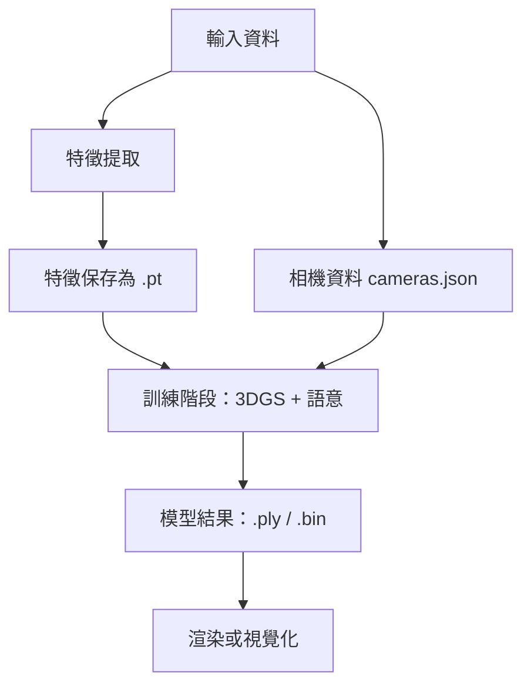

# Feature-3DGS 開發方向

本文整理 Feature-3DGS 系統的思維模型、可操作點、可修改部位，並描述每階段的產出形式，協助研究者從「跑通流程」進一步到「能掌握並改造系統」。

---

## 一、整體流程心智圖

以 3D Gaussian Splatting + Semantic Feature 為範例，整個系統可拆成幾個階段：



---

## 二、三大可操作階段

### 階段 1：語意特徵提取

- 可操作點：更換語意模型（`sam`、`lseg`、`clipseg`）、修改解析度與輸出維度
- 產出：一堆 `.pt` 檔案，每個是語意向量圖（例如 `[256, H, W]`）
- 可動手位置：
  - `extract_semantic_features.py`：修改模型、hook 特徵層
  - 特徵可視化：將 `.pt` 投影回 RGB heatmap 看語意強度

### 階段 2：訓練 3D 高斯模型

- 可操作點：調整特徵維度（`--semantic_feature_dim`）、修改 loss（語意對齊、特徵對比、CLIP loss）、自定義高斯參數
- 產出：訓練 log、最終的 `.ply`、`.bin`，甚至 `output_mesh.usd`
- 可動手位置：
  - `train.py`：閱讀 loss 組成
  - `models/`：調整 encoder、decoder、特徵融合邏輯

### 階段 3：渲染與可視化

- 可操作點：渲染模式切換（point cloud、mesh、gaussian raster）、語意 overlay、導出到 Unity / Omniverse
- 產出：`.ply`（Meshlab 可開）、`.bin`（splat config）、`.png` / `.mp4`
- 可動手位置：`viewer.py`、`export.py`，可加上自訂相機軌跡或語意上色

---

## 三、操作思維建立

| 思維層面 | 關鍵操作 | 類比領域 |
|---|---|---|
| 資料工程 | 圖像 → 特徵 → 訓練資料建構 | 資料前處理、數據準備 |
| 機器學習邏輯 | 調 loss、維度、模型結構 | 訓練調參、深度學習建模 |
| 視覺感知 | 調顏色、相機、渲染順序與效果 | 電腦圖學、XR 應用 |

---

## 四、實際成果總覽表

| 階段 | 檔案類型 | 內容說明 |
|---|---|---|
| 特徵提取 | `.pt` | 每張圖的語意特徵（如 `[256, 64, 64]`） |
| 相機資料 | `cameras.json` | 每張圖的相機姿態（intrinsic / extrinsic） |
| 點雲結果 | `.ply` | 每個點含位置、顏色（部分含特徵） |
| 模型結果 | `.bin` | 模型結構參數（splat config） |
| 可視化 | `.png`、`.mp4` | 渲染出的可視圖像 |

---

## 五、建議練習方向

1. 修改語意特徵提取邏輯（變模型、解析度、維度）並觀察 `.pt` 差異
2. 調整訓練維度與 loss（例：改 128 維、加入 cosine loss、看 loss 曲線）
3. 用 Meshlab 比對不同 `.ply` 的語意分佈
4. 將結果導出 `.usd` / `.obj`，整合到 Unity 或 Omniverse

---

## Feature-3DGS 專案分析

Feature-3DGS 是一個擴展原始 3D Gaussian Rasterization 的系統，加入語意特徵編碼功能。

### 核心功能

1. **特徵編碼的 3DGS 渲染**
   - 將語意特徵（LSeg / SAM 編碼器輸出）整合到 3DGS 中
   - 支援高維特徵渲染，特徵維度可調（`NUM_SEMANTIC_CHANNELS`）
   - 提供 CNN 加速模組以降維
2. **多功能互動式 viewer**
   - 可視化 RGB、深度、邊緣、法線、曲率、語意特徵
   - 提供 Windows 預編譯版本；支援 Ubuntu 22.04 本地編譯
3. **訓練與渲染**
   - 支援 COLMAP 或合成 NeRF 數據集
   - 編碼器選項：LSeg、SAM
4. **語意編輯**
   - 支援基於語言的場景編輯
   - 特徵提取、刪除、顏色修改等

### 技術細節

- **特徵維度**
  - LSeg：512 維（無加速）或 128 維（加速模式，`NUMBER=4`）
  - SAM：256 維（無加速）或 64 維（加速模式，`NUMBER=4`）
- **訓練流程**
  - 使用 `train.py`，支援學習率與密集化參數調整
  - 提供 checkpoint 保存與恢復
- **渲染與可視化**
  - `render.py`：從訓練/測試視角渲染
  - `view.py`：互動式操作
  - 特徵可視化以 PCA 降維到 RGB 空間

### 使用方式

```bash
# 訓練模型
python train.py -s data/DATASET_NAME -m output/OUTPUT_NAME -f lseg --speedup --iterations 7000

# 查看訓練模型
python view.py -s <path to COLMAP or NeRF dataset> -m <path to trained model> -f lseg

# 渲染視圖
python render.py -s data/DATASET_NAME -m output/OUTPUT_NAME --iteration 3000
```

### 應用場景

- 基於語言的 3D 場景編輯
- 3D 場景語意分割與理解
- NeRF 特徵增強
- 3D 重建與視覺化

---

## 相關筆記

- [[lseg-clip]] — LSeg + CLIP 原理
- [[sam-limitations]] — SAM 的極限與實際效果
- [[semantic-segmentation-models]] — 語意分割模型落地規劃
- [[sibr-remote-viewer]] — SIBR Viewer 操作說明
