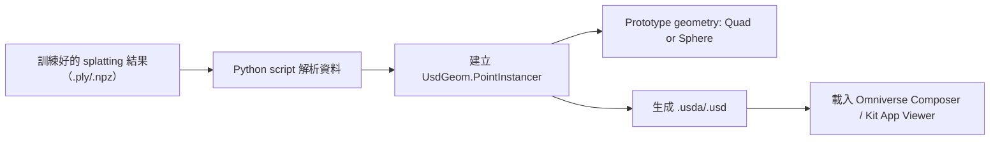

# USD PointInstancer 用於 Gaussian Splatting 視覺化

目標：

> ✅「現在先**做出能展示的 Gaussian Splatting 結果**在 Omniverse 中」
> 🔜「之後再整合更複雜的 AI 訓練、資料同步等模組」

可規劃一個 **最大化活用 `PointInstancer` 的路線圖**。

---

## 最佳實作策略：**Splat → PointInstancer + Material 資料分離模型**

| 模塊 | 設計策略 | 說明 |
|---|---|---|
| **資料格式** | 使用 `.ply` 或 `.npz` 匯出 `(位置、顏色、大小、alpha)` | 對應 Gaussian splat 的視覺參數 |
| **Omniverse 對應實體** | 用 `UsdGeom.PointInstancer` 建立粒子陣列 | 每個 splat 對應一個實例點 |
| **基本 Prototype Geometry** | 一個 `quad` 或 `sphere` 當 prototype | 可擴展為多種原型（如小圓球、小平面）|
| **Shader 表現** | 使用 MDL 材質 + per-instance attribute（color, alpha）| 模擬出「模糊半透明 + 高斯分布」的視覺效果 |
| **互動性** | 建立 orbit camera + 燈光設置 | 可即時繞場景檢視 splat 效果 |

---

## 技術架構流程（轉換 + USD 生成）

---

## 優勢（為什麼這策略最大化效益）

| 優點 | 描述 |
|---|---|
| 可快速視覺化大數據量 splat（10 萬～100 萬點）| `PointInstancer` 原生支援 GPU instancing |
| 可延伸為即時互動場景 | 例如滑鼠點擊特定點、改變 splat 特性等 |
| 可模組化、可自動化 | 後續結合 AI Pipeline 自動轉換都不難 |
| 不需自定 shader 就有「高斯感」效果 | 用 alpha + size 模擬即可，簡單有效 |

---

## 推薦行動

### 1. 確認輸入資料格式

- 手上的 splatting 資料目前是 `.ply`？還是 Graphdeco 的 `.npz/.splat`？

### 2. 工具開發建議

- `ply2usd_pointinstancer.py` 工具
    - 輸入 `.ply` → 輸出 `.usda`
    - 自動建立 PointInstancer + prototype
- 附加 MDL 材質設定（可選透明度 / 顏色）
- 一組 Omniverse Composer 測試用 Viewer USD

---

## 延伸：未來升級空間

| 功能 | 升級方式 |
|---|---|
| 多重 prototype 支援 | 使用 per-instance prototype index |
| Billboard 面向攝影機 | 加上 MDL 中的 camera-facing normal 計算 |
| 即時選點互動 | 加入 Extension，觸發 hover/pick 機制 |
| 結合 YOLO / pose estimation | 加入外部 Python socket 傳入位置動態更新 |
| 雲端上傳 + 訓練 | 串 Firebase 或 FastAPI，生成新 `.usd` |

---

## 相關

- [[../../3d-reconstruction/gaussian-splatting/gaussian-splatting]]
- [[extension-yolo]] — Socket 動態更新範例
- [[../usd/usd-customdata-conventions]] — USD 標註慣例
