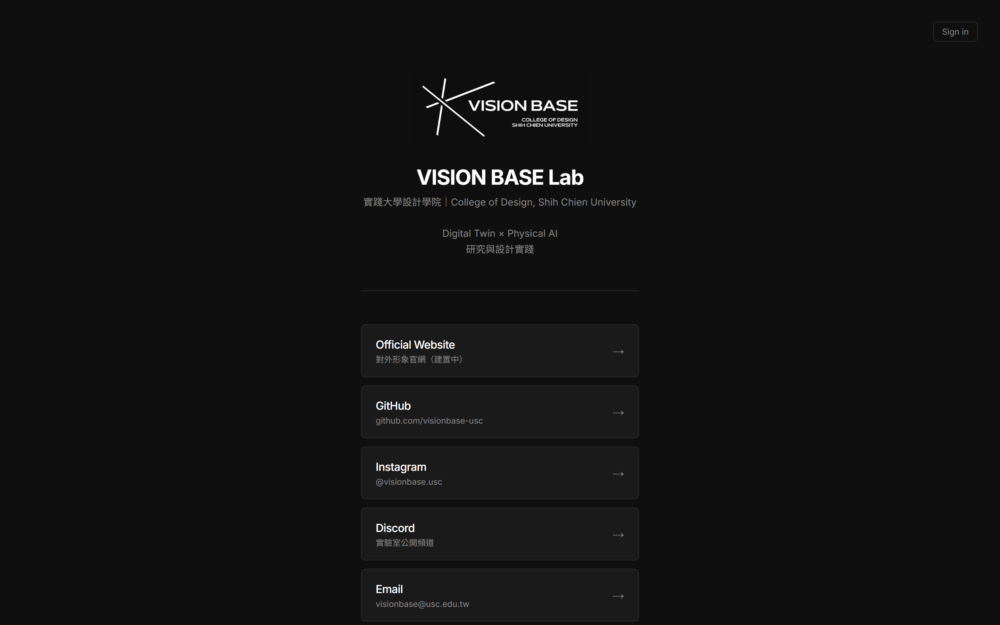

# linktree

VISION BASE Lab 的對外連結首頁(Linktree 風格)。任何人都看得到的「一頁式」連結中樞,搭配登入後的線上編輯器,白名單成員可直接 GUI 加 / 刪 / 改 / 排序連結,改完自動 commit 回 repo → Vercel 自動部署。

## 介面預覽

## 基本資訊

| 項目 | 值 |
|---|---|
| **URL** | [github.com/visionbase-usc/linktree](https://github.com/visionbase-usc/linktree) |
| **類型** | 對外靜態網站(Next.js + 線上編輯器) |
| **可見性** | 公開 |
| **預設分支** | `main` |
| **部署** | [Vercel](https://vercel.com)(自動部署 `main`) |
| **正式網址** | `visionbase.app` |

## 技術棧

| 層 | 選用 |
|---|---|
| Framework | Next.js 16(App Router) |
| UI | React 19 |
| 樣式 | Tailwind v4 + VB 品牌深色主題 |
| 字型 | Inter + Noto Sans TC |
| 認證 | Auth.js v5(Google provider + email 白名單) |
| 連結儲存 | `src/data/links.json`(via Server Action → GitHub API commit) |

## 路由

| Path | 內容 |
|---|---|
| `/` | 公開 linktree(讀 `src/data/links.json`) |
| `/login` | Google 登入頁 |
| `/members` | 編輯器頁(白名單登入後可加減連結) |

## 編輯流程

1. `/login` 用白名單 Google 帳號登入(預設 `visionbase.lab@gmail.com`)
2. 編輯器加 / 刪 / 改 / ↑↓ 排序連結
3. 按 **Save** → Server Action 透過 GitHub API commit 更新 `links.json`
4. Vercel 偵測 push → 30 秒內公開頁面更新

替代:直接編 `src/data/links.json` push 到 `main`。

## 視覺基底

VB 品牌書原始實作參考(這個 repo 是 VB 設計 token 的早期落地):

- 背景 `#0F0F0F` / 文字 `#FFFFFF` / 卡片 `#1A1A1A` / 分隔線 `#2A2A2A` / 輔助灰 `#8A8A8A`
- 6 色 accent 已定義為 CSS 變數,**不主動使用**
- 字型:Inter + Noto Sans TC(Avenir Next 優先)

## 環境變數(部署 / 本地)

| Key | 用途 |
|---|---|
| `AUTH_SECRET` | Auth.js session 簽章 |
| `AUTH_GOOGLE_ID` / `AUTH_GOOGLE_SECRET` | Google OAuth |
| `ALLOWED_EMAILS` | 編輯器登入白名單(逗號分隔) |
| `GITHUB_TOKEN` | Personal Access Token,讓編輯器有權 commit 回 repo |

詳細申請流程見 repo `README.md`。

## 維護者

- 開發:[@metaarchetech](https://github.com/metaarchetech)

## 相關 repo

- [`VBwebsite`](VBwebsite.md) — 完整對外形象官網(建置中)
- [`visionbase-monitor`](visionbase-monitor.md) — 內部監控站,沿用 linktree 的 VB 品牌 token
- [`claude-skills`](claude-skills.md) — 含 VB 品牌簡報模板 skill
