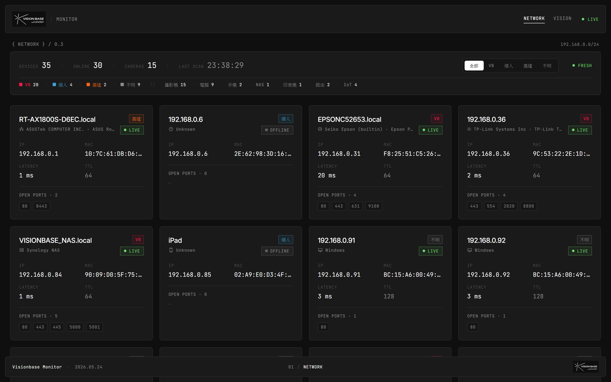
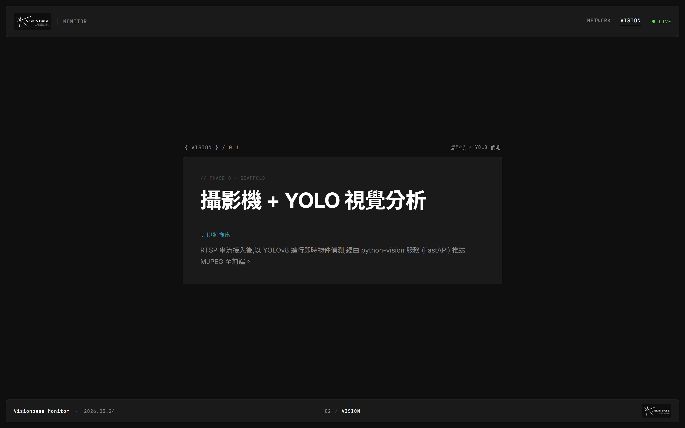

 
# visionbase-monitor

VISION BASE Lab 區網裝置監控 + 攝影機視覺分析站。Phase 0(scaffold)→ Phase 1A(真實掃描)→ Phase 1B(裝置分類)→ Phase 1C(VB 品牌識別套用),目前停在 Phase 1C 完成,下一步進 Phase 2(RTSP + YOLOv8 串流)。

## 介面預覽

### `/network` — 即時區網掃描

### `/vision` — 攝影機視覺分析(Phase 0 placeholder)

## 基本資訊

| 項目 | 值 |
|---|---|
| **URL** | [github.com/visionbase-usc/visionbase-monitor](https://github.com/visionbase-usc/visionbase-monitor) |
| **類型** | 內部 Web App(監控 + 視覺分析) |
| **可見性** | 私人 |
| **預設分支** | `main` |
| **本機路徑** | `C:\vision_base\visionbase-monitor`(對應開發機) |
| **開發 URL** | `http://localhost:3000`(本機 `192.168.0.220:3000`) |
| **監控對象** | `192.168.0.0/24`(VISION BASE 學校網路) |

## 技術棧

| 層 | 選用 |
|---|---|
| Framework | Next.js 16(App Router,Turbopack) |
| UI | React 19 + Framer Motion 12 |
| 樣式 | Tailwind v4 + VB 品牌 token(`@theme inline`) |
| 字型 | Inter + Noto Sans TC + JetBrains Mono |
| 後端(掃描) | Next.js API route → PowerShell 區網掃描 |
| 後端(視覺) | FastAPI(`python-vision/`,規劃接 RTSP → YOLOv8 → MJPEG) |
| 快取 | server 60s + client 30s 輪詢 |

## 路由

| Path | 內容 |
|---|---|
| `/` | 自動 redirect 至 `/network` |
| `/network` | 區網裝置監控(裝置卡片網格 + 統計列 + ownership filter) |
| `/vision` | 攝影機 + YOLO 視覺分析(Phase 0 placeholder) |
| `/api/scan` | 區網掃描 JSON 端點 |

## 視覺基底(Phase 1C 起)

依 VB 品牌書:深色主題、純黑背景、Inter + Noto Sans TC、6 色 accent 不主動使用。Ownership 色彩對映:VB → `vb-pink`、Personal → `vb-blue`、Infrastructure → `vb-orange`、Unknown → `vb-muted`。詳見 repo `README.md` 與 `docs/screenshots/`。

## 維護者

- 開發:[@metaarchetech](https://github.com/metaarchetech)

## 相關文件

- [[../02_專案/visionbase-lab/筆記/visionbase-monitor|專案筆記(02_專案)]] — 進度、Phase 規劃、待澄清項目
- [[../02_專案/visionbase-lab/network-inventory|區網盤點清單]]
- [[../02_專案/visionbase-lab/visionbase-lab|VISION BASE Lab 專案主頁]]

## 相關 repo

- [`linktree`](linktree.md) — 同樣套 VB 品牌深色主題,設計 token 共用來源
- [`claude-skills`](claude-skills.md) — VB 簡報公版 skill 在此
